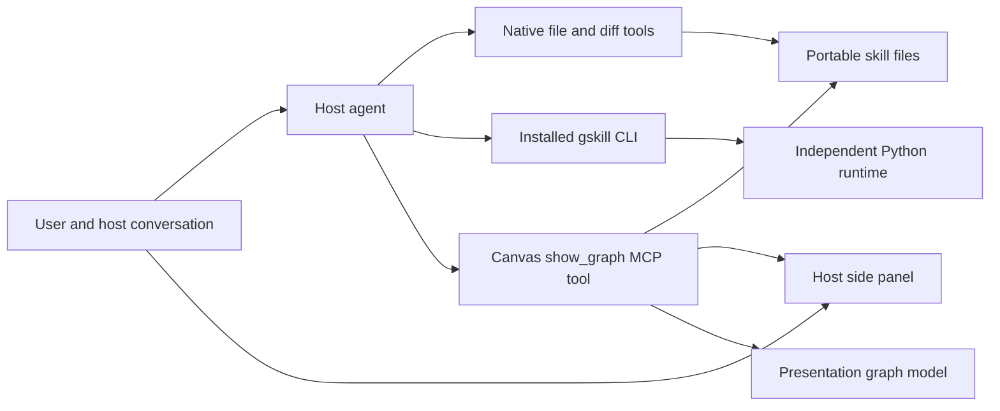

# Graph Skill agent plugin

The Graph Skill agent plugin gives a host agent a graph view and complete node properties beside the conversation. The host is the application in which the user works with the agent, such as Codex or Claude Code. The plugin is one integrated part of Graph Skill in this repository. Users discuss changes with their host agent; the agent edits the portable skill files with its normal tools, and the panel follows those files automatically. A small set of necessary option controls saves changes automatically.

This document defines the full proposed product architecture and the adopted local toolkit delivery boundary. The current delivery scope supplies shared Skills, command-line runtime access and a minimal graph canvas for Codex Desktop and Claude Code Desktop. Complete properties, node selection, source observation and option saving remain proposed capabilities. The [toolkit README](../../plugins/graph-skill/README.md) owns operating instructions, and its [validation record](../../plugins/graph-skill/VALIDATION.md#current-baseline-local-toolkit-delivery-2026-10-09) owns the current baseline and observed results. Desktop acceptance belongs to the user. The [basis record](./graph-skill-agent-plugin-basis.md) owns source history, alternatives and confidence. The [portable specification](../skill-spec/01-PORTABLE-GSKILL-V1.md) continues to own skill grammar, and the [runtime design](./v1-alignment.md#31-模块边界) owns the existing runtime boundary.

## 1. Product and installation boundary

The runtime is the independently installable execution engine. Its Python package stays at `src/graph_skill_runtime/`, with the distribution boundary defined in [`pyproject.toml`](../../pyproject.toml). The integrated product belongs in `plugins/graph-skill/`. Its local toolkit supplies the runtime, shared instructions and canvas through one explicit user-scoped installation and lifecycle.

| User scenario | Installed result | Lifecycle owner |
| --- | --- | --- |
| Engine in a service, remote deployment or headless process | The `graph-skill-runtime` Python distribution and its chosen runtime dependencies | The deploying application starts and stops its runtime. The distribution remains independent of plugin code, browser assets and Node.js dependencies. |
| Graph Skill in Codex Desktop and Claude Code Desktop | One local toolkit installation with a versioned product payload, private Node.js and Python runtimes, locked base dependencies, two shared Skills and the canvas connection | The product installer owns its recorded resources. The host discovers instructions and launches the canvas process; the user verifies actual Desktop behavior. |

Node.js is the JavaScript execution environment for the canvas and toolkit command. The private `package.json` owns its internal build and dependencies. Each `0.2.0` platform archive supplies Node.js, relocatable CPython, the independently built runtime wheel and its installed base dependencies, canvas server and HTML, hook, Skills, format reference and lifecycle entry points. CPython is the Python interpreter used by the runtime. Build-time assembly selects the interpreter archives and exports exact dependencies from the repository lock. Installation copies and verifies that complete payload and requires neither system Node.js/Python nor package-index access.

[`packaging/runtime-lock.json`](../../plugins/graph-skill/packaging/runtime-lock.json) owns the product's Node.js `24.21.0` and CPython `3.13.16` inputs and target identities. These are product pins, while the independent runtime distribution retains its own Python requirement and version. Native operating-system and library requirements still apply. The [validation record](../../plugins/graph-skill/VALIDATION.md) distinguishes target definitions, actual archives and native observations. Connected agents and network-dependent business activity retain their own connectivity requirements.

The user-scoped installer targets both named hosts by default and records owned paths, configuration selectors and file identities. Runtime-only deployments continue to install the Python distribution independently. Business skills remain explicit user-selected directories. Marketplace distribution and installation into real user profiles are outside the current implementation turn; the deliverable is source, a local archive and manual acceptance instructions.

## 2. Host, CLI and MCP architecture

The command-line interface (CLI) gives the host agent structured runtime operations through its normal shell tools. A Skill is a discoverable instruction file that explains when and how to use those operations. MCP, the Model Context Protocol, carries external tool requests and results. An MCP App links an HTML view to a tool result for display by a supporting host. The current delivery uses these responsibilities:

| Interface | Responsibility and callers | Ownership boundary |
| --- | --- | --- |
| Shared `graph-skill` Skill and installed `gskill` CLI | The host agent authors and reads files, then invokes compile, configuration resolution, predict, run, resume, submit, inspect or golden evaluation as the task requires. | [`adapters/cli.py`](../../src/graph_skill_runtime/adapters/cli.py) delegates to `RuntimeApplication` and emits structured JSON. Runtime contracts and semantic validation stay with the Python package. |
| Shared `graph-skill-canvas` Skill and canvas MCP connection | The host agent calls `show_graph` with an explicit absolute skill root after relevant work. | The product reads source for presentation and serves its shared HTML. Native file tools own edits and folder operations; the host owns display and focus. |
| Existing runtime SDK and eight-tool MCP server | Independent applications and integrations continue to use their public runtime interfaces. | Their existing behavior remains under the runtime's owners. Toolkit installation registers its own canvas connection and retains independently owned integrations. |

Invoking `gskill` through a shell preserves the runtime's executor selection rules. The default remains `host-native`: the runtime returns a durable Agent task, and the host supplies a fresh clean-context native subagent and submits its result. An explicit `--executor cli` selects a separate mode that runs vendor CLI processes. The shared Skill teaches the existing handoff contract; installation creates no model process or business skill registry.



The fuller graph-and-properties design below retains a future workspace bridge with `open_graph`, `read_graph_snapshot`, `patch_node_option` and `close_graph`. Those proposed tools own source observation and bounded option changes if that scope is implemented. Closing a session releases its resources, and transport disconnect releases connection-owned sessions. Each request is validated against its session, allowed root, stable identity and permitted operation.

The current `show_graph` tool declares read-only, non-destructive, idempotent, closed-world annotations. Future snapshot tools remain confined to the opened workspace; proposed session and option tools must disclose their lifecycle and filesystem effects. Runtime execution availability and source presentation have separate failure results.

MCP Apps is an MCP extension for serving an interactive HTML resource inside a supporting host. A tool advertises a `ui://` resource through `_meta.ui.resourceUri`; the resource uses `text/html;profile=mcp-app`. The browser adapter negotiates capabilities before use. The standard's `inline`, `fullscreen` and `pip` display modes do not establish side-panel placement. That placement is an acceptance condition for each host adapter. [MCP Apps overview](https://modelcontextprotocol.io/extensions/apps/overview), [display modes](https://apps.extensions.modelcontextprotocol.io/api/types/app.McpUiDisplayMode.html).

## 3. Rendering and host capabilities

The shared contract consists of graph data, properties, source references, selection and layout coordinates. Each host adapter renders those values with the facilities its host actually provides.

| Host surface | Evidence available on 2026-10-08 | Proposed adapter and remaining proof |
| --- | --- | --- |
| Codex desktop task panel | Installed Codex browser documentation describes existing MCP Apps in current-task side-panel tabs. OpenAI's public conversation-panel extension documentation explicitly describes ChatGPT. | Browser MCP App renderer. Verify custom plugin registration, actual panel placement and selection-context delivery in the target Codex build. ChatGPT documentation alone cannot establish that entry path. |
| Claude Desktop, local Code tab outside WSL | Claude documents Mods panes from bundled Code version `2.1.286`; its reference describes version `2.1.290`. | Native Mods renderer, with an interactive graph proof before feature acceptance. Exact installed version and supported element set must be recorded. |
| Claude Code terminal | Mods are documented from CLI `2.1.287`, including panes. | Native terminal renderer is a separate capability target. A terminal pane does not by itself demonstrate the requested graphical experience. |
| Claude Code VS Code chat, headless or cloud | Reviewed Mods documentation limits drawing to terminal and Desktop; VS Code chat runs hooks without drawing their panes. | These surfaces need a separately verified host UI route. A change to the requested target or experience requires a user decision. |

Sources: [OpenAI extensions](https://developers.openai.com/plugins/build/extensions), [Claude Mods availability](https://code.claude.com/docs/en/plugins/mods/overview), and [Claude Mods reference](https://code.claude.com/docs/en/plugins/mods/reference). The [basis](./graph-skill-agent-plugin-basis.md#host-evidence-and-its-limits) records the local Codex documentation coordinate. The current toolkit targets Codex Desktop and Claude Code Desktop with the shared MCP App. The table retains the fuller design's alternative rendering routes. Exact-version manual observations determine the delivered canvas's behavior in each target.

Claude Mods are plugin-contained JavaScript or TypeScript event handlers. Their interface uses `ui.render` and `$.ui.open` with native elements such as `Box`, `Text`, `Button` and `Select`. This is a restricted rendering environment, rather than a browser DOM, the browser's programmable page structure. The native adapter calls the bridge through `$.mcp.call`; its package declares the relevant server connection. [Interface guide](https://code.claude.com/docs/en/plugins/mods/interface), [API guide](https://code.claude.com/docs/en/plugins/mods/api).

React Flow is a browser graph-rendering library. Its extracted components belong to the browser renderer. Claude's documented Desktop `Svg` element can display vector graphics, but its isolated rendering does not establish JavaScript node-click handlers. A small SVG graph plus native selection and property controls can test the data connection; acceptance also requires direct graph-node selection in the chosen host. The native adapter may need a different interactive rendering technique. Installed-version typings and a real host test decide feasibility. [Published Mods typings](https://github.com/anthropics/claude-code/blob/main/mods/types/claude-code.d.ts).

## 4. Module ownership and dependency plan

All additions form one integrated module:

```text
plugins/graph-skill/
  package.json                 # private build unit
  document/                    # pure projection, properties, selection and layout
  bridge/                      # workspace use cases, ports and concrete adapters
  ui/                          # browser graph and properties renderer
  hosts/                       # Codex MCP App and Claude Mods integration
  packaging/                   # product manifest source, host projections, provisioning
  tests/                       # data, boundary, filesystem, protocol and host evidence
  THIRD_PARTY_NOTICES.md        # extracted source identity and attribution
```

A Port is an interface for an operation independent of its environment. An Adapter implements that interface using a particular filesystem, protocol or host. These are internal boundaries within the plugin module.

| Area | Input → output and owner | Allowed dependencies and failure behavior |
| --- | --- | --- |
| `document/` | Source text → graph/property snapshots, diagnostics, source-preserving field patches and pure layout. Owns the versioned view contract. | Pure data code and a source-aware YAML parser. YAML is the structured text format in portable declarations. Invalid input yields explicit diagnostics and available partial information. |
| `bridge/` | Session-bound operations → reads, watched revisions, option write acknowledgments and released resources. Owns file handles and mutations initiated through the plugin. | Document model plus filesystem and protocol Ports; concrete adapters provide I/O. Root denial, parse error, conflict and write failure remain distinct. |
| `ui/` | Snapshots and user actions → browser graph, properties and option intents. Owns transient view state. | Document contracts and the MCP App client. Filesystem and runtime implementation imports stay behind the bridge. |
| `hosts/` | Host events and selection → panel entry, native rendering, agent context and lifecycle signals. Owns host capability negotiation. | Shared document contracts and bridge operations. Unsupported operations appear as unavailable capabilities with their effect stated. |
| `packaging/` | Product version, canonical assets and tested runtime binding → installable host packages and provisioned launch configuration. Owns product installation records. | Existing public integration contracts or manifest-owned asset reads. Conflicts fail before projection writes. |

| Existing area | Planned treatment |
| --- | --- |
| Runtime source, Python public API, existing eight-tool MCP server | Reuse unchanged through their public contracts. The proposal requires no new runtime tool or core import. |
| [`integrations/assets/moirai/`](../../src/graph_skill_runtime/integrations/assets/moirai/) | Preserve its manifest and independently owned host projections. The current toolkit owns its two Skills and canvas connection. Any future reuse of MoirAI instructions must retain their canonical ownership. |
| Existing [`integrations/installer.py`](../../src/graph_skill_runtime/integrations/installer.py) | Retain its runtime-only installation behavior. Product preflight must detect its managed registrations. Any future shared ownership interface needs its own explicit contract and tests. |
| [`pyproject.toml`](../../pyproject.toml) and runtime packaging checks | Preserve the runtime wheel boundary. Add distribution-isolation evidence if packaging inputs change. No cosmetic runtime relocation is required. |
| Repository README, AGENTS, design map, CI and traceability | Update when implementation is accepted, to name the real module, commands, tests and supported hosts. Extend applicable `spec/` maps and validator coverage for plugin behavior as described below. |
| Current design change | Add this design and its basis, supersede the two historical editor proposals, and replace their design-map row. |

[`spec/features.yaml`](../../spec/features.yaml), [`spec/source_file_map.yaml`](../../spec/source_file_map.yaml) and [`spec/contract_map.yaml`](../../spec/contract_map.yaml) retain their authority over registered behavior, sources and contracts. Implementation must extend their applicable coverage and validator, or explicitly define a separate plugin-only scope in the accepted implementation design. The [frozen compliance checklist](../feature-compliance-checklist.md) remains generated from its owning manifest. Plugin records reference runtime contracts instead of duplicating them. The current Python import checker covers Python modules; plugin-specific dependency tests must enforce the TypeScript and host boundaries independently.

Source extraction uses `D:/coding/agent-harness` at `4693764e3489efdf21694dabd7b492c270d4121a`, under Apache-2.0. `GraphCanvas.tsx`, `SkillNode.tsx`, `GlobalInputOutputNode.tsx`, `PropertiesPanel.tsx`, `PanelHeader.tsx`, `PanelSection.tsx` and `lib/layout.ts` supply browser visual structure, node styles, grouping and layout ideas. The destination replaces source-specific workspace, run-state, Tauri desktop-shell and legacy-format dependencies with the boundaries above. The native renderer shares pure data and layout where feasible. The basis records exact source paths and limits.

## 5. User interaction and shared data

1. The user identifies a skill through the host's file facilities or conversation. The agent calls `open_graph` with that explicit root, and the host opens the panel.
2. The panel shows graph nodes and edges above the selected node's vertically arranged properties. Graph navigation includes the root graph, reusable graphs, dependencies and graph input/output boundaries.
3. Selecting a node publishes its root identity, graph ID, phase ID, source references and observed revision to the host's selection context. The user's next message can say “change this node” with that explicit selection available to the agent.
4. The host agent edits node instructions, schemas, code, nodes and edges through its native file tools. Source observation refreshes the graph and properties automatically.
5. Necessary option controls send narrow changes and show their automatic persistence status. File viewing and diffs use native host facilities, either through a verified UI capability or through an agent action.

The properties surface displays the information needed to understand each node directly. Source-file browsing remains a host operation; the panel provides neither an embedded code editor nor a form/source switch. Node creation, topology changes and substantive text editing are agent-mediated source changes. Selecting, panning and zooming update personal view state separately from business files.

All process-boundary data has a version and a discriminator identifying its message kind. The proposed snapshot contains a session ID, canonical root handle, graph and phase IDs, file revision hashes, source-relative locations, graph data, grouped properties and diagnostics. A content revision identifies the observed source set; it is independent of viewport state. A selection carries that revision so the agent can re-read changed files before editing. Display names come from `name`; stable identity comes from the portable graph and phase IDs.

For a browser MCP App, `ui/update-model-context` supplies selection for subsequent agent context. Optional `ui/message` is used only after host capability negotiation and an explicit user action. Native Claude prompt-context integration preserves user attribution and unrelated context. Selecting a node creates no gratuitous agent turn. A local file link uses a demonstrated host capability; `ui/open-link` alone supplies no universal native file-opening contract. [MCP App capabilities](https://apps.extensions.modelcontextprotocol.io/api/interfaces/app.McpUiHostCapabilities.html), [MCP Apps API overview](https://apps.extensions.modelcontextprotocol.io/api/documents/overview.html).

## 6. Complete projection and validation boundary

| Selected object | Necessary visible information |
| --- | --- |
| Graph | Identity, description, role declaration, input/output schema, phases and edges, output phases, iteration and root artifact declarations where applicable. |
| Every phase | Stable identity and display name, type, source location, dependencies and output status, input/output schema, validator declaration, overwrite policy, iteration and source diagnostics. |
| Agent phase | Declared role and graph-role selection, iteration limit, tools, context capabilities, subagents, subgraphs, resources and grouped role/goal/steps/protocols/examples from its body. |
| Logic phase | Action names and order, readable declared action descriptions, implementation file references and shared phase properties. |
| Subgraph phase | Referenced graph ID, navigable target, input/output boundary and shared phase properties. |

The field inventory follows the current [portable specification](../skill-spec/01-PORTABLE-GSKILL-V1.md#5-phase-文件), with fixtures covering every supported declaration. Schemas display as expandable field trees. Declared values and their source are always distinguishable from defaults or inherited values. Effective values appear only where their resolution is established by available inputs; missing runtime configuration is explicitly unavailable. The compiler-derived `system_prompt` is not an authoring field.

The bridge parses source as data. Opening a view or reacting to a file event must not import business Python modules or compile the skill. Current compilation can execute module loading, so the host agent invokes semantic validation explicitly through the runtime's existing public tools. Source parsing diagnoses malformed files; the runtime remains the owner of semantic compilation and execution judgments.

The current `InspectResult` supplies graph identities and call edges, rather than this complete phase/property view. The internal topology helper also skips malformed rows. The new document model therefore owns a data-only projection with visible errors, without treating either interface as a complete authoring contract.

## 7. Automatic saving and file lifecycle

Portable files are the sole authoritative business state. The plugin stores derived snapshots and transient view preferences. The host agent owns structural and textual edits; the bridge owns only the execution of a validated option-patch request.

The first integration proof uses `AGENT.md.use_graph_llm_role`, an existing boolean field. A later field allowlist may include `max_iterations` after its constraints and source-preserving edit are covered by tests. Complete properties do not require every property to be a manual control.

An option change follows this sequence: validate session and field → compare the expected file revision → prepare a minimal preserving edit → perform the coordinated write → re-read the stored bytes → acknowledge the resulting revision. The panel moves through pending, saved, conflict or failure according to observed results. It presents no Save or Discard workflow. Failure retains the intended option value with a clear unsaved indication; a retry first reads current source and never blindly overwrites it.

The bridge preserves unrelated text, comments and ordering. It serializes its own writes, resolves real paths within the allowed root and rejects unsafe symlink escapes. A revision check followed by atomic replacement reduces partial-write exposure; atomic replacement means readers see one complete file version. It does not give a global compare-and-swap against an independent agent writer. The first host proof must establish a shared write coordinator or route option intents through the host's native writer. Where coordination is unavailable, conflicting controls remain unavailable while the agent writes, or send the intent to the agent. A saved acknowledgment certifies the observed stored revision, with any later external change surfaced as a new revision. Host approval policy applies to automatic writes.

File observation handles agent writes, atomic renames, deletion and temporarily inconsistent multi-file edits. The bridge re-reads affected documents and checks their revisions before publishing a snapshot. Incomplete input produces diagnostics and an explicitly stale last-good view, with partial current data where safe. Deleting a selected node clears its selection. These reads are observations, not an atomic filesystem transaction.

Browser refresh uses a demonstrated notification path when the host supports it. An MCP resource-change notification reaching a host does not prove that an embedded page refreshed. Otherwise, a visible panel performs revision-aware snapshot polling with one outstanding request; it stops when hidden or closed. The observation interval controls refresh cost, not a business timeout or execution deadline. Claude invalidation and timers belong to its native adapter. Closing a view releases its session, watchers, timers and subscriptions; the host owns termination of its declared bridge process.

## 8. Packaging and installation ownership

The adopted `0.2.0` delivery has one complete archive per operating-system and processor target. Each archive contains an explicit installer, launched through `install.cmd` on Windows or `sh install.sh` on macOS/Linux. First installation and upgrade from `0.1.0` use the new extracted installer and its bundled interpreters. The current archive contract, `graph-skill.toolkit-bundle.v2`, binds the target, runtime executable locations, upstream provenance and shipped file hashes. The `graph-skill.toolkit-install.v1` record continues to own existing installation resources and exact update/uninstall checks.

Installed commands and host launch configuration use absolute paths in the private payload. Shared Skill templates render the private Python interpreter, isolated `-I -B -X utf8` invocation of the existing runtime module, the toolkit command and the installed portable reference path. Those interpreter options isolate module search, suppress bytecode writes and select UTF-8 mode. The source checkout is a build input; installed operation owns its own files. The [toolkit README](../../plugins/graph-skill/README.md) supplies concrete commands, default-profile requirements and shell conventions.

Product installation validates the actual platform, bound payload hashes, selected host resources and executable bindings before host writes. An unmanaged collision or a modified managed resource blocks the entire requested operation and preserves the existing content. The ownership manifest records exact files and the product's named JSON selectors or marked text blocks. Updates check prior ownership; uninstall removes exact owned files, selectors, launchers and PATH integration while retaining other settings, independently installed integrations, business skills, run state and the version cache. Retained versions remain available to any host entry or running process that still references them.

Codex receives the two Skills in its user Skill directory, a canvas server block in its user configuration and a hook entry. Claude Code receives the same Skills, its user canvas server selector and its hook entry. The host owns trust and approval settings. Restart, hook review and actual discovery are user-operated acceptance steps.

Rollback restores a touched resource only while its bytes still equal the operation's after-image. A concurrent change is preserved and reported as incomplete rollback. The installer excludes competing instances of itself locally; arbitrary host writers retain independent lifecycles. Package creation and configuration projection establish distinct facts from native rendering. User-profile installation, update, collision handling, uninstall and both Desktop surfaces require their own evidence before operational acceptance.

For a future remote runtime, the workspace bridge remains near the host and source files. Execution transport must bind an explicit skill bundle or artifact identity accepted by that service. A local path such as `D:\...` conveys local source location, not remote authority. This proposal establishes that separation; a remote execution protocol requires its own design and evidence.

## 9. Implementation order and acceptance

The local toolkit implementation is authorized by the 2026-10-09 baseline in [the validation record](../../plugins/graph-skill/VALIDATION.md). Its current package and lifecycle acceptance follow that record. The table below governs the fuller graph-and-properties proposal when that work is authorized. Product implementation evidence is reviewed by the coordinator; the user performs Desktop acceptance.

| Order and required result | Inputs and start condition | Acceptance and stop condition |
| --- | --- | --- |
| First: prove host integration and installation | Actual target host/surface/version, a disposable portable fixture, tested bridge launch capability and an explicit runtime artifact binding. Claude-specific work requires the user's surface selection. | One plugin installation opens the actual side panel; a trivial graph and properties render; direct node selection reaches the next agent turn; an agent's native source edit refreshes the panel; one necessary option auto-saves with truthful acknowledgment; close/reopen releases resources. Verify runtime-only installation excludes UI. An unavailable host API returns to adapter/target review before full visual extraction. |
| Second: complete graph and properties | The relevant host entry and interaction path have passed the first proof. Current portable grammar fixtures and extracted-source attribution are available. | Root/reusable graphs, all phase types, edges, input/output boundaries and necessary property groups are visible. Browser visuals and native rendering consume the same data contract. A missing property cannot be hidden behind source editing. |
| Third: establish resilient editing and maintenance | Working projection plus coordinated write path from the first proof. | Exercise field constraints, formatting preservation, stale revisions, concurrent writes, renames, symlink/root checks, invalid intermediate files, deletions, reconnect and cleanup. Register supported host versions and actual distribution/provisioning behavior. |

Pure tests cover portable-source fixtures, projection completeness, diagnostics, layout and narrow patch generation. Filesystem and protocol tests cover session ownership, annotations, source containment, refresh and write outcomes. Host-contract fakes check adapter behavior offline; real host tests prove installation, panel placement, graph interaction, context delivery and lifecycle. Package checks prove isolation between engine-only and full-plugin installation. These evidence layers are complementary.

Existing runtime acceptance remains scoped to its recorded artifacts and platforms. Historical canvas observations and current toolkit evidence live in the [validation record](../../plugins/graph-skill/VALIDATION.md). Complete graph properties, node interaction, file observation and option saving require the fuller design's evidence. Manual Desktop acceptance remains necessary for the current shared canvas workflow.
