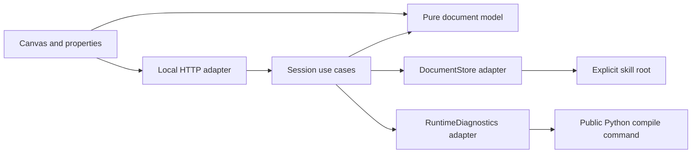

# Minimal Studio editor

Historical proposal, superseded by the [Graph Skill agent plugin design](./graph-skill-agent-plugin.md). Its body is preserved as prior decision evidence; the [current basis](./graph-skill-agent-plugin-basis.md#sources-and-baseline-change) records the replacement requirements and retained conclusions.

This proposal adds one independent `studio/` product module inside this repository. It provides a graph canvas and a properties panel for an explicitly selected local portable gSkill. The browser interface and its small local Node.js service share one TypeScript package; Node.js runs the service, while TypeScript describes the interface and service code. The existing Python distribution continues to own compilation and runtime behavior.

The current deliverable is this design. Implementation requires a subsequent authorized task. The [design basis](./studio-minimal-editor-basis.md) records sources, alternatives, confidence, and verification limits. The [portable format specification](../skill-spec/01-PORTABLE-GSKILL-V1.md) remains the authority for skill grammar.

## 1. Module plan

All paths in this tree are proposed additions:

```text
studio/
  package.json                 # one private package and local launch scripts
  package-lock.json            # one independently resolved dependency lock
  index.html
  src/
    editor/                    # canvas, properties, session drafts, small UI controls
    authoring/                 # portable document projection, range edits, shared messages
    local/                     # session use cases, file/process interfaces and adapters
      main.ts                  # explicit composition and service/process lifecycle
  tests/                       # unit, boundary, file/process integration, browser tests
  THIRD_PARTY_NOTICES.md        # extracted source revision, files, attribution
```

A Port is an interface describing an operation independently of its environment. An Adapter implements that operation using a concrete environment. These are small internal interfaces here, rather than additional packages.

| Internal area | Input → output and owner | Allowed dependencies and failure boundary |
| --- | --- | --- |
| `editor/` | Graph/document messages and user actions → selection, positions, one draft per opened phase, explicit save/validate requests. Owns browser draft state. | React, React Flow, shared authoring functions and the HTTP client. React Flow supplies graph interaction and rendering. Failed requests retain drafts. |
| `authoring/` | Source text and explicit field changes → source-preserving edits, graph display data, parse diagnostics. Owns Studio document projection and shared message definitions. | Pure TypeScript and a source-aware YAML parser. YAML is the structured text used by the portable files. Unsupported edits produce an error; runtime semantic validation remains compiler-owned. |
| `local/` | Session-bound requests → loaded documents, guarded single-file saves, compiler responses. Owns disk revisions, allowed file handles and serialization of its own writes. | Authoring functions plus `DocumentStore` and `RuntimeDiagnostics` Ports; filesystem, process and HTTP Adapters implement them. I/O errors and compiler protocol errors remain distinct. |
| `local/main.ts` | Explicit skill root and Python executable → one loopback service and one session. Owns construction, child cancellation and shutdown. | Concrete local Adapters; owns all handles until closed. The browser receives opaque document handles, rather than arbitrary write paths. |



The browser and document model have no filesystem or process imports. The service consumes the public runtime command. Studio introduces no Python import from the runtime into the product module. Studio boundary tests must exercise these rules independently; the existing Python import checker covers `graph_skill_runtime` only.

## 2. Existing-module changes

| Existing location | Planned implementation change |
| --- | --- |
| [`.gitignore`](../../.gitignore) | Add exclusions scoped to Studio dependencies, build output and test artifacts. |
| [Root README](../../README.md), [project rules](../../AGENTS.md), [design index](./README.md) | Add module navigation and explicit launch instructions when implemented. Preserve the historical release scope and current runtime claims. This design task adds only the drafted index row. |
| [CI](../../.github/workflows/ci.yml) | Add a separate Studio job for type checking, lint, boundary/unit/integration tests, browser smoke and build. Run it for Studio and relevant format/boundary changes; retain existing required runtime check identities. |
| [`pyproject.toml`](../../pyproject.toml) | Keep the single `uv` package and current wheel package selection. Add a targeted source-distribution exclusion for `studio/` if a built archive includes it. Studio dependencies stay in its own package. |
| [Distribution tests](../../tests/test_distribution_contract.py), [artifact acceptance](../../scripts/accept_release_artifacts.py) | Verify Studio code/dependencies/build output stay outside Python distributions. Extend only concrete absence checks required by that policy; retain source binding and immutable candidate acceptance. |
| [Feature manifest](../../spec/features.yaml), [source map](../../spec/source_file_map.yaml), [contract map](../../spec/contract_map.yaml) | Register implemented feature/source/test ownership at implementation time. Update the contract map only for a contract it owns; generate the compliance view if its owning manifest changes. |
| Runtime `domain`, `application`, `ports`, `adapters`, `core`, `integrations`, SDK and MCP | Initial implementation uses existing public behavior unchanged. Current portable grammar and configuration resolution remain with their existing owners. |

## 3. Proposed initial editing slice

The initial slice displays the root graph and edits existing root phases. This is a technical sequencing proposal for the user's minimal two-surface request. Additional topology authoring and registry-graph editing can follow an explicit scope decision.

The canvas displays each declared phase, its dependencies, and virtual input/output boundary nodes. It supports selection, pan, zoom, fit and automatic layout. A `SUBGRAPH` phase remains a single node showing its target graph reference. Positions live in the browser session; opening, moving or closing nodes writes no skill source.

Phase identity comes from `graph.yaml.phases[].id` and its directory. The type comes from `LOGIC.md`, `AGENT.md` or `SUBGRAPH.md`; `name` supplies the human display label. Identity, type, dependencies and output flags are read-only in this slice. Input/output boundary selection shows the graph's declared I/O read-only.

| Selected phase | Properties available for editing |
| --- | --- |
| All phase types | `name`; `io` as a structured-text section; the complete phase source in an advanced text area within the same panel. |
| `AGENT.md` | `llm_role`, `use_graph_llm_role`, `max_iterations`, `tools`, `context_access`, and body text. The body retains the portable role/goal/step/protocol structure. |
| `LOGIC.md` | `actions` declaration and body text. Action Python remains an existing external source file; this slice creates no action implementation. |
| `SUBGRAPH.md` | `graph`, the registry graph identifier. The referenced graph remains under `subgraphs/<graph_id>/graph.yaml`. |

Advanced source editing covers other current phase fields, including validators, iteration, resources and subagent declarations. The form is a convenience projection of that same draft. Changes in either representation update one draft; invalid raw text disables unsafe form edits while keeping text repair available. Compiled values such as `system_prompt` remain compiler-owned.

The proposed slice defers phase creation/deletion/identity renaming, edge/output edits, graph document editing, nested expansion, execution/replay, Gateway configuration, multiple workspaces and host plugin packaging. These operations introduce additional file or product owners. The two-surface editor establishes the document boundary first. Host rendering compatibility requires its own future evidence.

## 4. Source reuse

Extraction source: `D:/coding/agent-harness`, commit `4693764e3489efdf21694dabd7b492c270d4121a`; paths below are relative to `apps/studio/frontend/`. Implementation preserves the source's Apache-2.0 attribution and records each copied file and adaptation in `studio/THIRD_PARTY_NOTICES.md`.

| Existing source | Planned reuse |
| --- | --- |
| `src/components/GraphCanvas/GraphCanvas.tsx` | Extract the React Flow rendering and selection shell into `editor/`; remove workspace, runtime, Tauri desktop integration, resume and subgraph-expansion coupling. |
| `src/components/nodes/SkillNode.tsx`, `node-card.ts`, `GlobalInputOutputNode.tsx` | Reuse card visuals, selection and handles against a new small Studio node model. |
| `src/lib/layout.ts` | Adapt the pure dagre layout function. Dagre computes graph positions; its cycle error must stay visible. |
| `src/components/studio/panels/PropertiesPanel.tsx` | Reuse field presentation and grouping as reference; build a focused panel without its Gateway, runtime, filesystem and autosave dependencies. |
| `src/components/studio/panels/_shared/PanelHeader.tsx`, `PanelSection.tsx` | Extract the small panel structure. |
| `src/components/ui/input.tsx`, `textarea.tsx`, `button.tsx`, `src/index.css` | Extract necessary controls and style tokens with their directly required helpers. |
| `src/components/nodes/types.ts`, `src/components/GraphCanvas/canvas-authoring.ts`, `src/components/studio/panels/phase-frontmatter.ts` | Use as research evidence only. Their runtime fields and old `SKILL.md`/`src`/`mode`/subgraph `path` representations require a new current-format model. |

Select only dependencies used by the extracted slice: React/React Flow, layout, small controls/styles, source-preserving YAML support and build/test tooling. Resolve and lock them for Studio during implementation; the source package's versions are observations rather than a compatibility or security guarantee.

## 5. Read, save and validate

The launcher receives one explicit absolute skill root and configured absolute Python executable. The service resolves the root, reads root topology and declared phase files, and binds safe document handles to the session. It checks resolved containment and file identity on writes, including symlinks and Windows junctions. It offers no global discovery or arbitrary filesystem endpoint.

Parsing retains source text, comments, body and unedited fields. Form changes use syntax ranges or a concrete syntax tree, a representation that retains source formatting. A no-op must produce identical bytes. Exact roundtrip support is an implementation acceptance condition. Ambiguous constructs or unsupported transformations return an explicit editing error and leave the source available for manual repair.

Malformed `graph.yaml` produces an explicit topology error. A malformed phase remains identifiable with its source error and repair text. Cycles and unresolved edges retain declared nodes and show a visible diagnostic; layout failure can use stable list positions. A failed reload may retain the previous canvas only with an explicit stale label.

**Save** submits the selected phase's complete draft plus its expected file revision, the hash of that one file's bytes. The service serializes its own writes, re-reads the file, compares its hash with the expected revision, writes through a same-directory temporary file, and re-reads the result. The draft becomes clean only when returned bytes/revision match the submitted draft. Conflicts retain the draft and offer reload or manual reconciliation. The service performs no automatic conflict overwrite and promises no multi-file rollback.

Hash comparison and rename detect observed stale edits; they do not form an atomic comparison-and-swap against an uncooperative external editor. A write between comparison and replacement remains a race. The UI documents that limitation, and post-write mismatch is an explicit conflict. Stronger concurrent-edit guarantees would require a separately reviewed storage design.

Saving means bytes were persisted. It may save an incomplete or semantically invalid phase for incremental repair. **Validate** separately compiles persisted skill files and labels dirty drafts as excluded. Compile can import business Python modules, so this action is for a user-trusted local skill and is never triggered by opening the canvas.

The runtime Adapter starts the configured Python executable without a shell, using `['-m', 'graph_skill_runtime', 'compile', absoluteSkillRoot, '--no-cache']`. Its explicit working directory is a service-owned trusted directory, separate from the editable skill; the launch environment must also keep the skill out of Python's module-search configuration. Startup verifies the resolved runtime installation identity. Version is observation metadata: this unpublished project reuses its version across working-tree candidates, so format compatibility requires contract fixtures and actual response acceptance. There is no added `gskill studio` command. Decode output as UTF-8 and validate response `schema_version`/`kind`. Exit 0 with a passed `CompileResult` is success; exit 2 with a failed `CompileResult` carries diagnostics. A `RuntimeErrorPayload`, malformed output, spawn failure or inconsistent exit/result is a separate failure, never an empty successful diagnostic list. Keep stderr separate.

Validation uses a separate bundle observation fingerprint, covering the observed graph/phase documents and compilation inputs, including registry subgraphs, actions, tools and business resources. It records the fingerprint and its inventory before and after compilation; a selected phase's file hash is insufficient. Changed observations make results stale. When the Adapter cannot establish complete input coverage, it labels the result observational with that limitation instead of claiming validated-current. External mutations between observations remain outside an immutable-snapshot guarantee. Saves invalidate earlier diagnostics. Each validate request has an identity so late responses cannot replace newer results. Shutdown and explicit cancellation own compiler process cleanup; bounded output and any execution limit must be explicit configuration with evidence-based defaults, separate from progress reporting intervals.

## 6. Minimal local protocol and lifecycle

Shared messages use a versioned Studio envelope, proposed `studio.editor.v1`, and a discriminated `kind`. They are internal product contracts, separate from runtime public models. HTTP is only their local transport.

| Operation | Minimum request → response |
| --- | --- |
| Load session / phase | Session and optional phase handle → topology, read diagnostics, source text, file revision and field projection. |
| Save phase | Phase handle, expected file revision, draft text → saved source/file revision, or conflict/error retaining the client draft. |
| Validate persisted bundle | Request identity and bundle observation fingerprint → runtime result or runtime error, before/after fingerprints, inventory coverage and stale/observational status. |

Studio failures distinguish malformed requests, unknown handles, source parsing/edit limitations, revision conflicts, file access errors, runtime availability/protocol errors and cancellation. Preserve runtime diagnostic code, severity, source path, line and phase/graph coordinates when present. Runtime definitions stay in the existing [public models](../../src/graph_skill_runtime/domain/models.py).

One explicit launch owns one loopback listener, session token and root. Serve the page and API from one origin; require that exact origin and session token for mutating requests, reject unexpected Host values, and use no wildcard cross-origin policy. Shutdown stops new operations, settles active writes, cancels owned compiler processes and closes handles. Browser draft loss on closing a tab requires a dirty-state prompt; session drafts have no persistence promise.

## 7. Implementation order and acceptance

The implementation owner completes each row before starting its dependent work. Existing user skill files serve only as explicitly authorized inputs; automated tests use fixtures and temporary copies.

| Necessary result and dependency | Observable acceptance |
| --- | --- |
| Establish `studio/`, extraction notices and executable dependency rules | Independent install/typecheck/build; forbidden browser-to-filesystem and runtime-internal imports fail boundary tests. Python packaging excludes Studio artifacts. |
| Build source projection and range editing before wiring Save | Current portable fixtures cover all three phase types, malformed documents, comments, unknown/unshown fields, Unicode and no-op byte preservation. Unsupported edits fail with unchanged bytes. |
| Wire canvas/properties and one draft owner | Browser smoke opens a root graph, selects each type, edits its fields, switches form/source without losing edits, and retains dirty drafts through selection and failures. |
| Add guarded file saves and explicit runtime validation | Real temporary-file tests cover stale revisions, containment, failed writes, reload and post-write verification. CLI tests distinguish compile diagnostics, runtime errors, UTF-8, cancellation and stale responses. |
| Integrate and review the complete two-surface flow | Browser smoke saves and reopens the intended change, displays actual compile diagnostics, and proves open/layout/close leave skill bytes unchanged. Run Studio checks and all required repository gates; record platform and dependency-audit limits. |

If extraction requires the old backend or format grammar, stop that dependency path and reduce the extracted component. If source preservation fails, keep raw editing available and repair or narrow the affected form transformation before enabling its save path. Completion requires the observed workflow above; a generated bundle or green runtime suite alone cannot establish Studio behavior.
