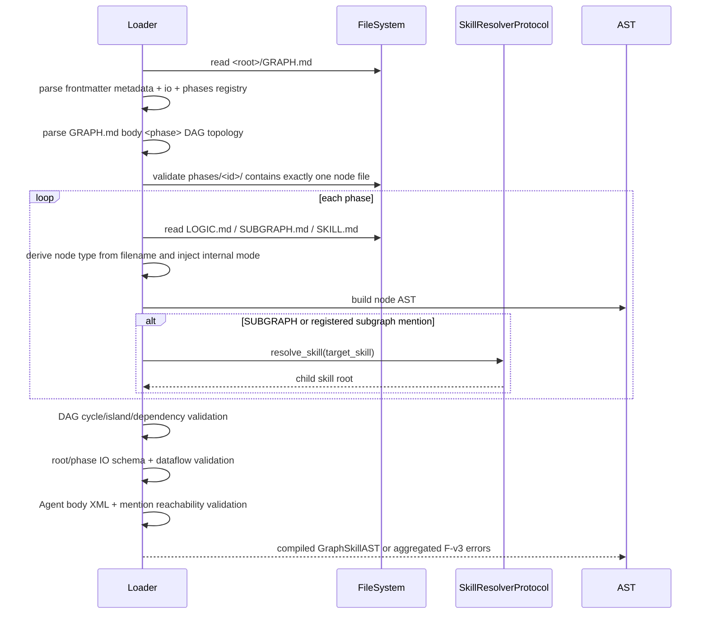

<!-- DO NOT EDIT: Golden principle contract baseline. Any divergence is strictly prohibited unless explicitly approved. -->

> 🔖 **本文 = mvp0 迁移源档案，非当前 SSOT。** 三段生命周期契约已迁入 [`mvp1 compile-rules §2`](../../mvp1/01-contract/03-compile-rules/mvp1-alignment.md#2-三段生命周期契约)。StateMapper required 规则在 mvp1 中作为目标契约保留；当前代码 drift 见 `02-mechanism/04-run-outer/01-graph-exec` baseline。
<!-- 核对进度:已迁 3 块 / 未迁 0 块 / 2026-06-05 -->

~~# Compile Runtime Flow Spec~~ → ✅[已迁入](../../mvp1/01-contract/03-compile-rules/mvp1-alignment.md#2-三段生命周期契约)

本文定义 graph_skill 从 Loader 编译、Template 装配到运行时执行的生命周期。它串联 [物理布局](./01-physical-layout.md#物理结构拓扑-directory-tree)、[Cognitive Template](./06-cognitive-template-spec.md#8-大插槽布局拓扑)、[错误码字典](./11-error-code-spec.md#错误码速查全表) 和 5 个 Engine 子模块 alignment。

~~## 编译期校验流 (Compile-time Workflow)~~ → ✅[已迁入](../../mvp1/01-contract/03-compile-rules/mvp1-alignment.md#21-编译期校验流compile-time-workflow)

编译期目标是把磁盘上的 graph_skill 变成可信 AST, 并在任何执行前发现结构、字段、拓扑、IO、mention 依赖问题。



步骤级契约:

| 步骤 | 输入 | 输出 | 主要校验 | 失败错误码 |
|---|---|---|---|---|
| 读取根 | `<root>/GRAPH.md` | raw markdown | 文件存在 | `[F-v3-graph-phase-dir-missing]` 等物理错误 |
| 解析根 frontmatter | raw markdown | Graph metadata AST | name/version/phases registry/io | `[F-v3-graph-schema-version-mismatch]`, `[F-v3-graph-io-schema-invalid]` |
| 解析根 body 拓扑 | raw markdown body | DAG edges/output marks | `<phase depends_on>` 与 frontmatter phases/目录一致; name mismatch 与重复注册分码 | `[F-v3-graph-depends-unknown]`, `[F-v3-graph-phase-id-invalid]`, `[F-v3-graph-phase-name-mismatch]`, `[F-v3-graph-phase-id-duplicate]`, `[F-v3-graph-output-phase-invalid]` |
| 扫描 phase 目录 | `phases[]` | phase file map | 每个 phase 恰好一个节点文件 | `[F-v3-graph-phase-mode-ambiguous]` |
| 解析 phase 节点 | node md | Logic/Subgraph/Agent AST | 文件名类型推导、字段表、body XML | domain-specific F-v3 |
| DAG 校验 | frontmatter phases + body depends_on | topological order | 依赖存在、无环、无孤岛 | `[F-v3-graph-phase-cycle]`, `[F-v3-graph-phase-island]` |
| IO 数据流校验 | root IO + phase IO | dataflow map | 输入来源存在、输出字段合法 | `[F-v3-graph-dataflow-source-missing]` |
| Mention 校验 | Agent AST | mention refs | 7 类静态可达 | `[F-v3-mention-target-not-found]` |
| 错误聚合 | all checks | error report | 同阶段尽量聚合 | 各 domain code |

编译期不执行 action、不调用业务 Agent, 但可以调用 resolver 做 skill root 可达性检查。Reference reader 不在编译期跑, 它属于装配期。

本流程引用 [Physical Layout](./01-physical-layout.md#物理结构拓扑-directory-tree)、[GRAPH Phase DAG](./02-graph-md-spec.md#phases-注册与-body-拓扑校验-phase-registration--dag) 和 [Mention Syntax](./07-mention-syntax-spec.md#7-大分类静态可达性算法)。

~~## Template 装配流 (Assembly-time Workflow)~~ → ✅[已迁入](../../mvp1/01-contract/03-compile-rules/mvp1-alignment.md#22-template-装配流assembly-time-workflow)

装配期目标是把可信 AST 变成可运行 LangGraph 节点, 并为 Agent phase 构造最终 system prompt。

```text
Compiled GraphSkillAST
  └─ for each AgentNodeAST
      ├─ collect references/examples/tools/subagents/subgraphs
      ├─ run builtin reference reader subagent on references
      │    ├─ success: markdown knowledge report
      │    └─ fail: WARN + raw excerpt fallback
      ├─ render cognitive template slots
      │    ├─ static: role/goal/steps/protocols
      │    └─ dynamic: knowledge_base/examples registries/output_schema
      └─ build LangGraph Agent node with tools + prompt + max_iterations
```

字段级装配输入:

| 输入 | 来源 | 必填 | 默认值 | 失败错误码 | 输出 |
|---|---|---|---|---|---|
| Agent AST | `SKILL.md` | 是 | 无 | `[F-v3-agent-*]` | prompt static slots |
| references registry | frontmatter `references` | 否 | `[]` | `[F-v3-resource-reference-invalid]` | reader input + registry listing |
| inline examples | SKILL.md body `<example id>` | 否 | `[]` | `[F-v3-agent-example-invalid]` | `{skill_examples_inline}` |
| examples registry | frontmatter document `examples` | 否 | `[]` | `[F-v3-resource-example-invalid]` | `{example_registry_listing}` |
| output schema | `io.outputs` | 是 | 无 | `[F-v3-cognitive-output-schema-render-failed]` | `{output_schema}` in hardcoded exit_contract |
| tools list | frontmatter `tools` + builtin | 否 | builtin minimum tools | `[F-v3-agent-tool-unknown]` | Agent tool bindings |

装配顺序必须保证:

1. 先有完整 Agent AST, 再跑 reference reader。
2. Reference reader 失败只写 WARN trace, 不中断装配。
3. `read_reference` / `read_example` tools 在 prompt 完成前绑定, 因为模板正文会提到这些工具。
4. 系统内置默认 `exit_contract` 带 output_schema 放在最终 prompt 末尾。

本流程引用 [Cognitive Template 内部插槽布局](./06-cognitive-template-spec.md#8-大插槽布局拓扑) 与 [Builtin Reference Reader Subagent 签名](./09-builtin-modules-spec.md#builtin-reference-reader-subagent-签名)。

~~## 运行时引擎流 (Run-time Workflow)~~ → ✅[已迁入](../../mvp1/01-contract/03-compile-rules/mvp1-alignment.md#23-运行时引擎流run-time-workflow)

运行期目标是按 DAG 执行节点, 用 BlackboardState 做统一状态, 并把所有失败归一成 `[F-v3-*]`。

```text
graph.invoke(inputs)
  ├─ validate inputs against GRAPH.md io.inputs
  ├─ BlackboardState init
  ├─ for phase in topological_order
  │    ├─ StateMapper.slice(state, phase.io.inputs) -> phase_input
  │    ├─ run phase
  │    │    ├─ LOGIC: execute actions -> validator -> output
  │    │    ├─ AGENT: run ReAct loop with tools -> finish_task -> output
  │    │    └─ SUBGRAPH: invoke child compiled graph -> output
  │    ├─ validate output against phase.io.outputs
  │    └─ StateMapper.merge(state, output)
  ├─ validate final state against GRAPH.md io.outputs
  └─ return outputs + trace
```

节点运行契约:

| 节点 | 输入 | 执行器 | 输出 | 失败行为 |
|---|---|---|---|---|
| LOGIC | `phase_input` dict | action 链 + validator | dict | action/validator 失败不回写, 报 `[F-v3-logic-*]` |
| AGENT | `phase_input` dict + prompt + tools | LLM ReAct loop | finish_task JSON | tool/输出校验失败按 Agent runtime 策略重试或 FATAL |
| SUBGRAPH | `phase_input` dict | child graph invoke | dict | 子图失败冒泡, 包装 parent phase context |

StateMapper 规则:

| 操作 | 规则 | 失败错误码 |
|---|---|---|
| init | 根 inputs 必须满足 `GRAPH.md io.inputs` | `[F-v3-runtime-state-mapping-failed]` |
| slice | phase `io.inputs.required` 字段必须在当前 state 中存在 | `[F-v3-runtime-state-mapping-failed]` |
| merge | phase output key 必须是 `io.outputs.properties` 子集 | `[F-v3-runtime-state-mapping-failed]` |
| final | 根 outputs required 字段必须已产生 | `[F-v3-runtime-state-mapping-failed]` |

运行时错误归一化:

| 来源 | 原始异常 | 归一错误码 |
|---|---|---|
| action import/run | Python exception | `[F-v3-logic-action-return-invalid]` 或 `[F-v3-runtime-phase-failed]` |
| validator | Validation exception | `[F-v3-logic-validator-failed]` |
| builtin tool 参数 | Tool validation error | `[F-v3-tool-argument-invalid]` |
| reference/example id 不存在 | Registry lookup error | `[F-v3-resource-reference-not-found]` / `[F-v3-resource-example-not-found]` |
| 子图运行失败 | child GraphSkillError | 保留 child code, 加 parent phase context |

本流程引用 [Execution Runtime MVP0 Alignment](../execution-runtime/mvp0-alignment.md) 与 [State and IO Contract MVP0 Alignment](../state-and-io-contract/mvp0-alignment.md)。
