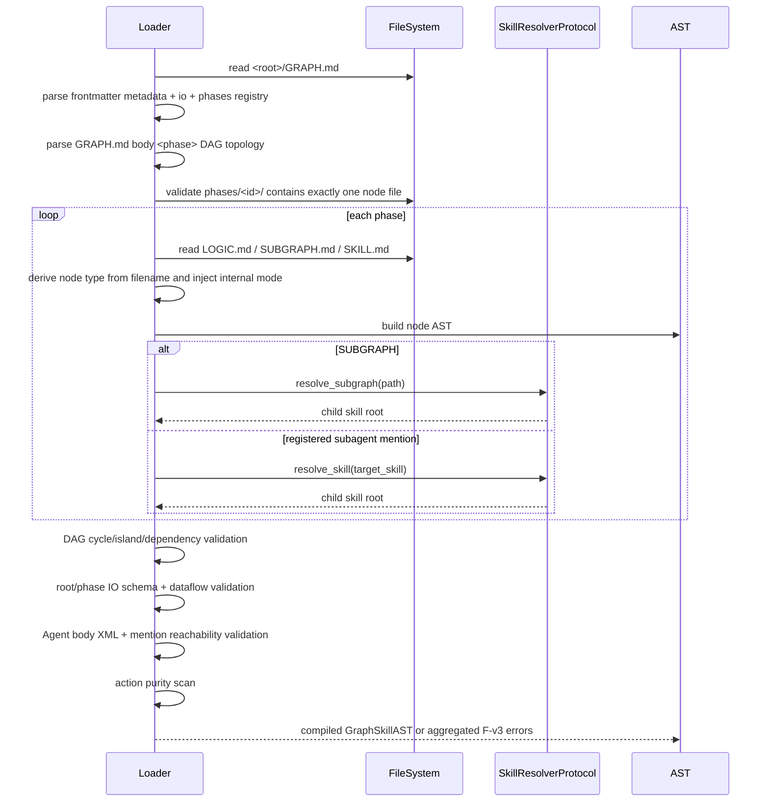

# 03-compile-rules — 契约 A · 编译规则 + 错误码全表

> **Tier**: 契约层 A(声明式,喂 copilot) | **Owns**: 编译/装配/运行生命周期契约 + 全部校验规则(DAG/IO/mention/purity/golden/iterate)+ `[F-v3-*]` 错误码全表 | **现状**: mvp1 自承载,代码 registry 88 码 | **Related**: `skill-syntax`(被校验语法)· `01-compile`(扫描器实现)· `invalidation`/`06-golden-eval`(golden eval 期)· `02-iterate`(iterate 新码目标)· `03-api-contract`(CompileResult)

## 1. 定义
compile-rules = skill **要满足什么才合法可编译**,以及 Loader **怎么判、错误怎么报**(`[F-v3-*]`)。这是喂 copilot 的核心:copilot 生成的 skill 必须过这些规则。规则是声明式契约；扫描器实现归 `02-mechanism/01-compile`，运行外层行为归 `02-mechanism/04-run-outer/01-graph-exec`。

本文件现在是 compile-rules 的 mvp1 SSOT，不再链接 mvp0 spec 当权威。88 个现有码以 `packages/graph-agent/src/graph_agent/core/error_registry.py:ERROR_REGISTRY` 为代码 baseline；本文件保留迁移源里的「具体原因 / 修复建议」，避免旧文删除后丢失解释语义。

Implementation binding: the public compile entry is
`packages/graph-agent/src/graph_agent/core/compiler.py:compile_skill`; it is a
facade that normalizes caching/resolver/runtime input fields and delegates to
`packages/graph-agent/src/graph_agent/core/loader.py:SkillLoader.compile_skill`.
`loader.py` is an orchestration pipeline, not a "one function per rule" file:
helpers implement parser, topology, IO/dataflow, resolver/subgraph, mention, and
purity stages, and each stage may emit one or many registered `[F-v3-*]`
diagnostics. The rule contract is this document plus
`error_registry.py:ERROR_REGISTRY`; every new or changed compile rule must update
the registry, preserve the documented code semantics, and add tests that bind
rule input -> code -> source_path/line/field_path/severity.

## 2. 三段生命周期契约

### 2.1 编译期校验流(Compile-time Workflow)
编译期目标是把磁盘上的 graph_skill 变成可信 AST，并在任何执行前发现结构、字段、拓扑、IO、mention、resolver、purity 依赖问题。



步骤级契约:

| 步骤 | 输入 | 输出 | 主要校验 | 失败错误码 |
|---|---|---|---|---|
| 读取根 | `<root>/GRAPH.md` | raw markdown | 文件存在、root 是 V0.3.0 skill 目录 | `[F-v3-graph-root-missing]` |
| 解析根 frontmatter | raw markdown | Graph metadata AST | name/version/phases registry/io | `[F-v3-graph-schema-unknown-field]`, `[F-v3-graph-name-invalid]`, `[F-v3-graph-schema-version-mismatch]`, `[F-v3-graph-io-schema-invalid]` |
| 解析根 body 拓扑 | raw markdown body | DAG edges/output marks | `<phase depends_on>` 与 frontmatter phases/目录一致；name mismatch 与重复注册分码 | `[F-v3-graph-depends-unknown]`, `[F-v3-graph-phase-id-invalid]`, `[F-v3-graph-phase-name-mismatch]`, `[F-v3-graph-phase-id-duplicate]`, `[F-v3-graph-output-phase-invalid]` |
| 扫描 phase 目录 | `phases[]` | phase file map | 每个 phase 恰好一个节点文件 | `[F-v3-graph-phase-mode-ambiguous]`, `[F-v3-graph-phase-node-missing]` |
| 解析 phase 节点 | node md | Logic/Subgraph/Agent AST | 文件名类型推导、字段表、body XML、节点 IO schema | domain-specific F-v3 |
| 递归解析子 skill | SUBGRAPH / subagent target | child skill root / child AST | resolver 注入、skill id、路径、递归链路 | `[F-v3-compile-recursion-cycle]`, `[F-v3-compile-depth-exceeded]`, `[F-v3-resolver-*]`, `[F-v3-skill-*]` |
| DAG 校验 | frontmatter phases + body depends_on | topological order | 依赖存在、无环、无孤岛 | `[F-v3-graph-phase-cycle]`, `[F-v3-graph-phase-island]` |
| IO 数据流校验 | root IO + phase IO + runtime_config input fields | dataflow map | phase `io.inputs.properties` 声明消费的每个字段都必须有 root input / upstream output / runtime_config import binding / iterate-batch 注入来源；输出字段合法、串联覆盖需授权 | `[F-v3-graph-dataflow-source-missing]`, `[F-v3-sequential-overwrite-unauthorized]` |
| Mention 校验 | Agent AST | mention refs | 静态可达、类型/语法合法 | `[F-v3-mention-*]` |
| Purity 校验 | action/tool Python 文件 | purity report | action 必须纯；mvp1 目标硬禁 `run_skill`/文件系统/`sys.path`/import 越界 | `[F-v3-logic-action-purity-violation]` |
| 错误聚合 | all checks | error report | 同阶段尽量聚合，payload 至少含 code/level/stage/message/doc_link | 各 domain code |

编译期不执行 action、不调用业务 Agent。resolver 可用于 skill root 可达性检查。reference reader 不在编译期跑，它属于装配期。

### 2.2 Template 装配流(Assembly-time Workflow)
装配期目标是把可信 AST 变成可运行 LangGraph 节点，并为 Agent phase 构造最终 system prompt。

```text
Compiled GraphSkillAST
  -> for each AgentNodeAST
      -> collect references/examples/tools/subagents/subgraphs
      -> run builtin reference reader subagent on references
         -> success: markdown knowledge report
         -> fail: WARN + raw excerpt fallback
      -> render cognitive template slots
         -> static: role/goal/steps/protocols
         -> dynamic: knowledge_base/examples registries/output_schema
      -> build LangGraph Agent node with tools + prompt + max_iterations
```

字段级装配输入:

| 输入 | 来源 | 必填 | 默认值 | 失败错误码 | 输出 |
|---|---|---|---|---|---|
| Agent AST | `SKILL.md` | 是 | 无 | `[F-v3-agent-*]` | prompt static slots |
| references registry | frontmatter `references` | 否 | `[]` | `[F-v3-resource-reference-invalid]` | reader input + registry listing |
| inline examples | SKILL.md body `<example id>` | 否 | `[]` | `[F-v3-agent-example-invalid]` | `{skill_examples_inline}` |
| examples registry | frontmatter document `examples` | 否 | `[]` | `[F-v3-resource-example-invalid]` | `{example_registry_listing}` |
| output schema | `io.outputs` | 是 | 无 | `[F-v3-cognitive-output-schema-invalid]` | `{output_schema}` in hardcoded exit_contract |
| tools list | frontmatter `tools` + builtin | 否 | builtin minimum tools | `[F-v3-agent-tool-unknown]`, `[F-v3-agent-tool-reserved]` | Agent tool bindings |
| reference reader input/output | references registry | 否 | raw excerpt fallback | `[F-v3-reference-reader-failed]` | knowledge report |

装配顺序必须保证:

1. 先有完整 Agent AST，再跑 reference reader。
2. Reference reader 失败只写 WARN trace，使用 fallback，不中断装配。
3. `read_reference` / `read_example` tools 在 prompt 完成前绑定，因为模板正文会提到这些工具。
4. 系统内置默认 `exit_contract` 带 output_schema 放在最终 prompt 末尾。

### 2.3 运行时引擎流(Run-time Workflow)
运行期目标是按 DAG 执行节点，用 BlackboardState / WorkflowState 做统一状态，并把所有失败归一成 `[F-v3-*]`。

```text
graph.invoke(inputs)
  -> validate inputs against GRAPH.md io.inputs
  -> BlackboardState init
  -> for phase in topological_order
      -> StateMapper.slice(state, phase.io.inputs) -> phase_input
      -> run phase
         -> LOGIC: execute actions -> validator -> output
         -> AGENT: run ReAct loop with tools -> finish_task -> output
         -> SUBGRAPH: invoke child compiled graph -> output
      -> validate output against phase.io.outputs
      -> StateMapper.merge(state, output)
  -> validate final state against GRAPH.md io.outputs
  -> return outputs + trace
```

节点运行契约:

| 节点 | 输入 | 执行器 | 输出 | 失败行为 |
|---|---|---|---|---|
| LOGIC | `phase_input` dict | action 链 + validator | dict | action/validator 失败不回写，报 `[F-v3-logic-*]` |
| AGENT | `phase_input` dict + prompt + tools | LLM ReAct loop | finish_task JSON | tool/输出校验失败按 Agent runtime 策略重试或 FATAL |
| SUBGRAPH | `phase_input` dict | child graph invoke | dict | 子图失败冒泡，包装 parent phase context |

StateMapper 目标规则:

| 操作 | 规则 | 失败错误码 |
|---|---|---|
| init | 根 inputs 必须满足 `GRAPH.md io.inputs` | `[F-v3-runtime-state-mapping-failed]` |
| slice | phase `io.inputs.required` 字段必须在当前 state 中存在（**递归**:每一层 object 的 `required` 都算，嵌套子字段用点路径 `chapter.aa_number`；子字段仅在其父 object 存在时才被检查——标准 JSON-Schema 语义） | `[F-v3-runtime-state-mapping-failed]` |
| merge | phase output key 必须是 `io.outputs.properties` 子集 | `[F-v3-runtime-state-mapping-failed]` |
| final | 根 outputs required 字段必须已产生 | `[F-v3-runtime-state-mapping-failed]` |

✅ 现状（2026-07-03 起）:`runtime/state_mapper.py` 分两步:`StateMapper.select_declared_inputs` 先按 `io.inputs.properties` 过滤,`StateMapper.require_declared_inputs` 再走 `_missing_required_inputs`(→ 递归 `_missing_required_paths`)在**每一层 object** 校验 `required` 缺失,缺失即 `[F-v3-runtime-state-mapping-failed]`,`field_path` 为点路径。这与 output 侧 `_validate_phase_updates_against_schema` 的 `Draft202012Validator` 一致——两个映射方向现在都在**所有嵌套层级**执行同一份 required 契约(此前 input 侧只查顶层,studio io 面板 config 树能展开显示的嵌套子字段却在运行期不被 required 拦截,即 drift;本次统一消除)。studio 侧据此把该运行期失败提前到配置期可视化(见 `docs/studio/mvp1/03_regions/input/mvp1-alignment.md` F3 字段对账三态)。

运行时错误归一化:

| 来源 | 原始异常 | 归一错误码 |
|---|---|---|
| action import/run | Python exception / non-dict return | `[F-v3-logic-action-return-invalid]` 或 `[F-v3-runtime-phase-failed]` |
| action output | 未声明字段 | `[F-v3-logic-output-field-undeclared]` |
| validator | Validation exception | `[F-v3-logic-validator-failed]`, `[F-v3-agent-validator-failed]`, `[F-v3-subgraph-validator-failed]` |
| builtin tool 参数 | Tool validation error | `[F-v3-tool-argument-invalid]` |
| reference/example id 不存在 | Registry lookup error | `[F-v3-resource-reference-not-found]` / `[F-v3-resource-example-not-found]` |
| 子图运行失败 | child GraphSkillError | 保留 child code，加 parent phase context |
| 无法归入更细分支的 phase 失败 | unknown phase exception | `[F-v3-runtime-phase-failed]` |

## 3. 错误码设计模式 + payload 契约
格式:

```text
[F-v3-<domain>-<specific>]
```

字段级定义:

| 部分 | 类型 | 必填 | 默认值 | 校验规则 | 业务作用 |
|---|---|---|---|---|---|
| `F` | literal | 是 | 无 | 固定为 `F` | 表示 framework/format 级错误，不是业务判断失败 |
| `v3` | literal | 是 | 无 | 固定为 `v3` | 对应 V0.3.0 / mvp1 承接的契约族 |
| `domain` | enum | 是 | 无 | `graph`, `compile`, `logic`, `subgraph`, `agent`, `mention`, `resource`, `resolver`, `cognitive`, `tool`, `runtime` | 定位失败模块 |
| `specific` | kebab-case | 是 | 无 | 小写字母数字短横线 | 定位具体规则 |

既有兼容项:`[F-v3-sequential-overwrite-unauthorized]` 是现有码之一，代码与迁移源一致，但它没有显式 domain 段；迁移期保留，不重命名。

等级:

| 等级 | 含义 | 是否中断 | 典型场景 |
|---|---|---|---|
| FATAL | 契约无法满足，继续会产生错误执行或不可定位状态 | 是 | 字段缺失、phase 节点文件冲突、IO schema 不合法 |
| WARN | 契约主体可满足，但质量或可维护性下降 | 否 | reference reader 失败降级、未使用 registry entry |

错误 payload 必须至少包含 `code`, `level`, `stage`, `message`, `doc_link`；推荐包含 `skill_id`, `phase_id`, `field_path`, `source_path`。各字段 spec 的 FATAL / WARN 判断最终收敛到本节命名规则。

**两个 phase 之间的冲突要报出两个 phase。** 有一类规则的主语本身就是两个 phase 的关系——同一个输出字段被串联覆盖（`[F-v3-sequential-overwrite-unauthorized]`）或被并行写入（`[F-v3-parallel-write-conflict]`）。这类诊断在常规轴之外还带 `conflicting_phase`：`source_path` 处那个 phase 的 `field_path` 字段，与 `conflicting_phase` 那个 phase 的声明相撞。`field_path` 指向**冲突的那个字段**（`io.outputs.properties.<key>`），不是解决冲突要改的那个 frontmatter 键。理由是消费方需要这两个事实（Studio 画布要把冲突画在节点上、并让作者就地授权），而校验器求值时它们本来就在手里；只写进 `message` 等于逼消费方正则解析英文句子，措辞一改就散架。单 phase 规则保持 `conflicting_phase = None`——没有第二个参与者就不许声称有。

**子 skill 的诊断带着全部轴到达父 skill。** 一个 subgraph phase 会去编译它指向的子 skill；子 skill 编译失败时，父编译把子诊断当作自己的诊断重新报出来。这道接缝上**只有 `source_path` 是重新算的**——它只有相对某个被声明的 root 才有意义，而子 skill 声明的是自己的 root，所以要先还原成绝对路径，再由父编译按父 root 渲染（父画布因此拿到 `subgraph/<a>/subgraph/<b>/phases/<p>/...` 这样可直接寻址的路径）。**其余每一轴原样携带**，包括 `field_path` 与 `conflicting_phase`。这条要写成规则而不是靠人记得：接缝原先是逐字段列举复制，于是新加的结构化事实在别处都对、**唯独跨一层 subgraph 就没了**，而且没有任何东西会因此失败——`conflicting_phase` 就是这么在嵌套情形下变回 `None`、把画布逼回去读英文句子的（台账 K6）。`severity` 两者都不是：loader 只报 FATAL，这一点在 `_compile_result` 说一次，不逐条重复。

TraceEventKind(例如 `AMBIGUITY_LOGGED` / `BUILTIN_SUBAGENT_FALLBACK`)不是错误码，不进入本速查表；事件协议由 observability / API 契约维护。

### 3.1 错误契约 V2(通用消费者增强，目标归 kiro)
> **动机**:engine 是**通用引擎**，对接的是各类 app(不止 studio)。当前 payload 够"分类 + 编译期校验"，但对通用消费者**负载太薄**(扁平、定位轴可选且常空、无结构化 details、无 remediation、doc_link 是仓库相对路径、run 只返回单个 error)。证据:studio 不得不自建 `{...,details}` error 模型且没消费 4 轴(`_api-handshake-audit.md` §3.1 G1-G6)。下表是 **V2 目标契约**，现状逐条标注，**实现归 kiro**。

| 增强 | 现状 | 目标契约 |
|---|---|---|
| **G1 定位轴必填** | `skill_id/phase_id/field_path/source_path` 全可选、默认 None，只在调用点手动传(`exceptions.py:31-34`)，普遍空 | 按 domain 定**必填轴**:编译期码必填 `source_path`(file:line)+ 适用时 `field_path`;运行期码必填 `phase_id`(+`skill_id`);各 raise 点强制填(= Task 3 审计逐码核)。`source_path` 带行号(承接 `data-contracts` DC4 `line` 轴)。 |
| **G2 结构化 details** | `ErrorPayload` 全扁平字符串、无 details;异常 `GraphAgentError.context: dict`(`exceptions.py:100`)转 payload 时**被丢弃** | `ErrorPayload` 加 `details: dict[str,Any]`，**把异常 context 序列化进去** + 每码约定结构化键(如 `graph-phase-cycle`→`{cycle_path:[...]}`;`graph-dataflow-source-missing`→`{phase_id, field, candidate_upstreams:[...]}`;`*-schema-unknown-field`→`{field, allowed:[...]}`)。消费者据此做富 UX / 自动修复，不靠正则抠 message。 |
| **G3 remediation 进负载** | "修复建议"只在本文 §4 文档表，运行期拿不到;`ErrorCodeMetadata`(`error_registry.py:8`)无该字段 | `ErrorCodeMetadata` 加 `remediation: str`(把 §4 的"修复建议"搬进注册表);`ErrorPayload.remediation` 由校验器从注册表自动回填(同 level/stage/doc_link)。 |
| **G4 doc_link 可解析 + 公开码表** | doc_link 是仓库相对路径(`docs/engine/mvp1/...#anchor`，`error_registry.py:16+`)，第三方 app 无此仓库 = 死链 | doc_link 改**稳定标识** `graph-agent://errors/<code>`(或发布的 HTTPS URL);并经 API 暴露**可枚举错误码表**(code→{level,stage,remediation,doc})，外部 app 自建 error UX(端点归 `03-api-contract`)。 |
| **G5 统一 diagnostics 列表** | run 只返回单个 `RunResult.error`(`result.py:79`);WARN 只走事件流、不进 RunResult;消费者要 merge error+trace 才得全集 | `RunResult` 加 `diagnostics: list[ErrorPayload]`(FATAL+WARN 全集，一处拿全);`error` 保留为主致命(兼容)。对齐编译期 `CompileResult.issues` 的列表语义(形状归 `data-contracts`)。 |
| **G6 运行期细化 + 注册待加码** | 运行期靠 catch-all `[F-v3-runtime-phase-failed]`，粒度粗;异常树有 ToolExecution/StateTransform/Checkpoint/TraceWrite/Artifact/ModelProvider(`exceptions.py`)但无对应码;golden/iterate 新码族已进 `ERROR_REGISTRY` | 运行期码继续对齐异常树细分(tool / state-transform / persistence / provider 各给码);新增码必须先注册进 registry(带全四轴 + remediation)，再放开 emit(见 §6)。 |

> **职责分布**:形状改动(`ErrorPayload.details/remediation`、`RunResult.diagnostics`)落 `data-contracts`(owns 形状);API 暴露(diagnostics 字段 + 码表端点)落 `03-api-contract`;本域 owns 规则(必填轴 / 结构化键约定 / 码注册 / remediation 文案)。三处双向引用。

### 3.1.1 V2 细化 + 实施分期(codex 复审 2026-06-06 采纳)
codex 复审确认 G1-G6 方向对,补强为"通用 app 可长期消费的协议",采纳如下细化(逐条已核工程合理性):
- **G1 定位**:`source_path`(file:line 字符串)→ 结构化 `source_span:{path, line, column?, end_line?, end_column?}`(列/末位可选,parser 不一定有;`source_path` 保留为兼容别名)。`phase_id` 单值不够嵌套 → `phase_path:[{skill_id, phase_id, phase_execution_id, kind}]`(kind=logic|agent|subgraph|iterate),定位子图/子代理/iterate 多轮;`phase_execution_id` 与 V4 trace 同源。**G1 分阶段**:不立即硬必填(会打爆现有直接构造 payload 的调用点),改由 registry `location_requirements` 按 domain 软校验、逐码补齐(P1)。
- **G2 details**:`details: dict[str, JsonValue]`(传输形状)+ registry 每码 `details_schema`(JSON Schema 描必填键/类型)——**非自由 dict、也非 Python union**;P0 先给高频码 + 运行期码定 schema,其余空 details 但必须 **JSON-safe + 脱敏 + 可序列化**(防泄密,security 规范)。
- **G3 remediation**:`remediation: str`(P0)+ registry 可选 `remediation_actions:[{kind, label, args_schema}]`(给 app 做自动修复按钮,P1/P2)。
- **G4 doc**:拆 `doc_ref: graph-agent://errors/<code>`(稳定机器引用)+ `doc_url: https://.../errors/<code>`(可点击);`doc_link` 留弃用别名;只能留一个则选 HTTPS。
- **G5 diagnostics**:**事件 + 快照双轨、不双写语义**——新增 `DiagnosticEmittedEvent`(实时,带完整 `ErrorPayload` + `diagnostic_id`)走事件流;`RunResult.diagnostics` 是最终快照(+ 主 fatal `error`),靠 `diagnostic_id` 关联。diagnostics **有界**:`diagnostics_limit` / `diagnostics_truncated` / `diagnostic_counts`(按 code/level 计数),防 batch/iterate 无限长。
- **G6 stage 机器化**:`stage`(中文 tuple)留作展示,补 `stage_id: compile|assemble|runtime|persistence|provider`(机器判断);运行期码按此细分(tool/state-transform/persistence/provider),对齐异常树。
- **新增维度(P1/P2,通用 app 长期能力)**:i18n(`message_key` + `template_vars`,默认文案保留);错误码生命周期(`introduced_in` / `deprecated_in` / `replaced_by` / `status`,供外部 app 安全升级);`GET /errors` 信封(`registry_version` / `schema_version` / `items` / `next_cursor` / `etag` + level/stage/domain/code_prefix/deprecated 过滤,归 `03-api-contract`)。

**实施分期(codex 采纳)**:
- **P0-1**(G2+G5 最小闭环):`details` + 序列化异常 `context` + `RunResult.diagnostics` + 上限/截断 + 定义 snapshot↔event 关系。
- **P0-2**(G3+G4 registry 化):registry 增 `remediation` / `doc_ref` / `doc_url` / `details_schema` / `schema_version`;`GET /errors` 版本化信封。
- **P0-3**(G6 安全加码):先注册 golden/iterate 待加码,运行期先拆 tool/state-transform/persistence/provider,避免 catch-all + 未注册码炸消费者。
- **P1**:G1 全面轴审计(`source_span` / `phase_path` / `location_requirements`,逐码补齐,不一次硬切)。
- **P1/P2**:i18n、弃用生命周期、`GET /errors` 分页/过滤、`remediation_actions`。

**向后兼容(impl 注意,归 kiro)**:加字段本身 additive 安全(`diagnostics=[]` / `details={}` / `remediation=None`);风险点:(a) `ErrorCodeMetadata` 现为 `NamedTuple` + 位置参数(`error_registry.py:8`),加字段须改 dataclass/Pydantic 或关键字构造,否则全量改 93 行;(b) `doc_link` 改 scheme/HTTPS 是语义变化,保留弃用别名;(c) studio 多处 `extra="forbid"` 模型(`RunMetadata` / `RunDetail` / `ErrorResponse`),加 diagnostics 须同步 studio 模型 + TS 类型(engine 加字段 / studio 同步 = 跨边界协同)。

## 4. 错误码全表(88)
本表与 `ERROR_REGISTRY` 逐码核对:98 个现有码一个不少，code set 与 stage 完全一致。表内「具体原因 / 修复建议」来自迁移源并在 mvp1 保留；Spec 链接均指向 mvp1 文档。

### graph domain

| 错误码 | 阶段 | 具体原因 | 修复建议 | Spec |
|---|---|---|---|---|
| `[F-v3-graph-schema-unknown-field]` | 编译期 | `GRAPH.md` frontmatter 出现未知字段 | 删除字段或纳入 spec | [GRAPH](../02-skill-syntax/mvp1-alignment.md#2-语法部件清单--mvp1-写入状态) |
| `[F-v3-graph-name-invalid]` | 编译期 | `name` 缺失或命名非法 | 改为小写开头标识 | [GRAPH](../02-skill-syntax/mvp1-alignment.md#2-语法部件清单--mvp1-写入状态) |
| `[F-v3-graph-schema-version-mismatch]` | 编译期 | `schema_version` 不是 `"v0.3.0"` | 升级/降级 spec 或 engine | [GRAPH](../02-skill-syntax/mvp1-alignment.md#2-语法部件清单--mvp1-写入状态) |
| `[F-v3-graph-llm-role-unknown]` | 编译期 | `llm_role` 未注册 | 使用 `llm_roles.yaml` 中角色 | [GRAPH](../02-skill-syntax/mvp1-alignment.md#2-语法部件清单--mvp1-写入状态) |
| `[F-v3-graph-root-missing]` | 编译期 | `<skill_root>/GRAPH.md` 缺失或大小写不匹配 | 创建精确命名的 `GRAPH.md` | [Physical](../01-physical-layout/mvp1-alignment.md#21-skill-源码树) |
| `[F-v3-graph-phases-dir-missing]` | 编译期 | `<skill_root>/phases/` 缺失 | 创建 phases 目录 | [Physical](../01-physical-layout/mvp1-alignment.md#21-skill-源码树) |
| `[F-v3-graph-phases-missing]` | 编译期 | `GRAPH.md` frontmatter 缺少 `phases` 列表 | 添加 `phases: [...]` 名字注册 | [GRAPH](../02-skill-syntax/mvp1-alignment.md#2-语法部件清单--mvp1-写入状态) |
| `[F-v3-graph-phase-id-invalid]` | 编译期 | phase name 命名规则非法 | 修正 phase name 为合法标识 | [GRAPH](../02-skill-syntax/mvp1-alignment.md#2-语法部件清单--mvp1-写入状态) |
| `[F-v3-graph-phase-name-mismatch]` | 编译期 | body `<phase>` name / frontmatter `phases` 注册名 / 物理目录名三者不一致 | 对齐 body、frontmatter 和目录名 | [GRAPH](../02-skill-syntax/mvp1-alignment.md#2-语法部件清单--mvp1-写入状态) |
| `[F-v3-graph-phase-id-duplicate]` | 编译期 | phases 列表 id 重复 | 去重 | [GRAPH](../02-skill-syntax/mvp1-alignment.md#2-语法部件清单--mvp1-写入状态) |
| `[F-v3-graph-depends-unknown]` | 编译期 | body `<phase depends_on>` 引用未声明 phase | 修正依赖名 | [GRAPH](../02-skill-syntax/mvp1-alignment.md#2-语法部件清单--mvp1-写入状态) |
| `[F-v3-graph-output-phase-invalid]` | 编译期 | body `output` 标记无效或无法确定输出 phase | 修正 `<phase ... output>` 标记 | [GRAPH](../02-skill-syntax/mvp1-alignment.md#2-语法部件清单--mvp1-写入状态) |
| `[F-v3-graph-phase-cycle]` | 编译期 | DAG 存在环 | 打断循环依赖 | [GRAPH](../02-skill-syntax/mvp1-alignment.md#2-语法部件清单--mvp1-写入状态) |
| `[F-v3-graph-phase-island]` | 编译期 | phase 与入口不可达 | 增加依赖连接或删除孤岛 | [GRAPH](../02-skill-syntax/mvp1-alignment.md#2-语法部件清单--mvp1-写入状态) |
| `[F-v3-graph-phase-mode-ambiguous]` | 编译期 | 同一 phase 下多个节点文件 | 保留 `LOGIC.md`/`SUBGRAPH.md`/`SKILL.md` 之一 | [Physical](../01-physical-layout/mvp1-alignment.md#21-skill-源码树) |
| `[F-v3-graph-phase-node-missing]` | 编译期 | phase 目录下没有节点文件 | 添加 `LOGIC.md`/`SUBGRAPH.md`/`SKILL.md` 之一 | [Physical](../01-physical-layout/mvp1-alignment.md#21-skill-源码树) |
| `[F-v3-graph-io-not-object]` | 编译期 | 根 IO 顶层不是 object schema | 设置 `type: object` | [GRAPH](../02-skill-syntax/mvp1-alignment.md#2-语法部件清单--mvp1-写入状态) |
| `[F-v3-graph-io-schema-invalid]` | 编译期 | 根 IO JSON Schema 非法 | 修正 schema | [GRAPH](../02-skill-syntax/mvp1-alignment.md#2-语法部件清单--mvp1-写入状态) |
| `[F-v3-graph-io-physical-file-deprecated]` | 编译期 | 使用旧 `io/inputs.json` 或 `io_inputs_ref` | 改为 inline `io.inputs` / `io.outputs` | [Physical](../01-physical-layout/mvp1-alignment.md#21-skill-源码树) |
| `[F-v3-graph-dataflow-source-missing]` | 编译期 | phase input 没有根输入或上游输出来源 | 补依赖或调整 IO | [GRAPH](../02-skill-syntax/mvp1-alignment.md#2-语法部件清单--mvp1-写入状态) |
| `[F-v3-sequential-overwrite-unauthorized]` | 编译期 | 串联节点覆盖写入重名变量且未显式白名单授权 | 在 Frontmatter 中声明 allow_sequential_overwrite 允许覆盖 | [GRAPH](../02-skill-syntax/mvp1-alignment.md#2-语法部件清单--mvp1-写入状态) |
| `[F-v3-parallel-write-conflict]` | 编译期 | 无依赖先后关系的两个并行 phase 声明写同一个 output 字段 | 让该字段只有一个 owner，或用 depends_on 排出先后次序 | [GRAPH](../02-skill-syntax/mvp1-alignment.md#2-语法部件清单--mvp1-写入状态) |

### compile domain

| 错误码 | 阶段 | 具体原因 | 修复建议 | Spec |
|---|---|---|---|---|
| `[F-v3-compile-recursion-cycle]` | 编译期 | subgraph/subagent 递归编译链路中再次遇到已在加载栈内的 skill root | 打断 skill 间循环引用或抽出共享子图 | [Error Code](#compile-domain) |
| `[F-v3-compile-depth-exceeded]` | 编译期 | subgraph/subagent 递归编译深度超过安全上限 | 降低嵌套深度或合并中间 skill | [Error Code](#compile-domain) |
| `[F-v3-iterate-accumulate-fields-missing]` | 编译期 | loop iterate 声明缺 `item_var` 或 `accumulate.var` 对应的 `io.inputs` 字段 | 在 loop 节点 `io.inputs` 声明 item 与累积字段 | [Iterate](../../02-mechanism/04-run-outer/02-iterate/mvp1-alignment.md) |
| `[F-v3-iterate-over-not-list]` | 编译期/运行期 | iterate `over` 指向的 schema 或运行期值不是 list/array 形态 | 调整 `over` 字段 schema、输入值或 iterate 声明 | [Iterate](../../02-mechanism/04-run-outer/02-iterate/mvp1-alignment.md) |

### golden domain

| 错误码 | 阶段 | 具体原因 | 修复建议 | Spec |
|---|---|---|---|---|
| `[F-v3-golden-stale-fields]` | eval 期 | `.workspace/golden` 中某节点 expected output 缺当前 `io.outputs.required` 字段 | 重新生成或补齐该节点 golden | [Golden Eval](../../02-mechanism/05-run-inner/06-golden-eval/mvp1-alignment.md) |

### logic domain

| 错误码 | 阶段 | 具体原因 | 修复建议 | Spec |
|---|---|---|---|---|
| `[F-v3-logic-schema-unknown-field]` | 编译期 | LOGIC frontmatter 未知字段 | 删除字段 | [LOGIC](../02-skill-syntax/mvp1-alignment.md#2-语法部件清单--mvp1-写入状态) |
| `[F-v3-logic-io-schema-invalid]` | 编译期 | Logic IO schema 非法 | 修正 object schema | [LOGIC](../02-skill-syntax/mvp1-alignment.md#2-语法部件清单--mvp1-写入状态) |
| `[F-v3-logic-actions-empty]` | 编译期 | `actions` 为空 | 声明至少一个 action | [LOGIC](../02-skill-syntax/mvp1-alignment.md#2-语法部件清单--mvp1-写入状态) |
| `[F-v3-logic-action-name-invalid]` | 编译期 | action 名非法 | 使用一级合法函数名 | [LOGIC](../02-skill-syntax/mvp1-alignment.md#2-语法部件清单--mvp1-写入状态) |
| `[F-v3-logic-action-dir-missing]` | 编译期 | phase-local `actions/` 缺失且 action 未在通用 registry 注册 | 创建目录或注册通用 action | [LOGIC](../02-skill-syntax/mvp1-alignment.md#2-语法部件清单--mvp1-写入状态) |
| `[F-v3-logic-action-not-found]` | 编译期 | phase-local action py 文件不存在且通用 registry 无此项 | 增加 `<name>.py` 或注册通用 action | [LOGIC](../02-skill-syntax/mvp1-alignment.md#2-语法部件清单--mvp1-写入状态) |
| `[F-v3-logic-action-entrypoint-missing]` | 编译期 | action 无 `run()` | 导出 `run` | [LOGIC](../02-skill-syntax/mvp1-alignment.md#2-语法部件清单--mvp1-写入状态) |
| `[F-v3-logic-action-purity-violation]` | 编译期 | action 代码包含本地写等副作用违例 | 移除 `open('w')` 等非纯操作 | [LOGIC](../02-skill-syntax/mvp1-alignment.md#2-语法部件清单--mvp1-写入状态) |
| `[F-v3-logic-action-return-invalid]` | 运行期 | action 返回非 dict | 返回 dict | [LOGIC](../02-skill-syntax/mvp1-alignment.md#2-语法部件清单--mvp1-写入状态) |
| `[F-v3-logic-output-field-undeclared]` | 运行期 | 返回未声明输出字段 | 更新 `io.outputs` 或删字段 | [LOGIC](../02-skill-syntax/mvp1-alignment.md#2-语法部件清单--mvp1-写入状态) |
| `[F-v3-logic-validator-type-invalid]` | 编译期 | `validator` 不是 boolean | 改为 true/false | [LOGIC](../02-skill-syntax/mvp1-alignment.md#2-语法部件清单--mvp1-写入状态) |
| `[F-v3-logic-validator-missing]` | 编译期 | `validator: true` 但无文件 | 增加同级 `validator.py` | [LOGIC](../02-skill-syntax/mvp1-alignment.md#2-语法部件清单--mvp1-写入状态) |
| `[F-v3-logic-validator-entrypoint-missing]` | 编译期 | validator 无 `validate()` | 导出 `validate` | [LOGIC](../02-skill-syntax/mvp1-alignment.md#2-语法部件清单--mvp1-写入状态) |
| `[F-v3-logic-validator-failed]` | 运行期 | logic validator 抛异常 | 修正输出或校验规则 | [LOGIC](../02-skill-syntax/mvp1-alignment.md#2-语法部件清单--mvp1-写入状态) |
| `[F-v3-agent-validator-failed]` | 运行期 | agent validator 抛异常 | 触发 LLM 重试反馈 | [Agent](../02-skill-syntax/mvp1-alignment.md#2-语法部件清单--mvp1-写入状态) |
| `[F-v3-subgraph-validator-failed]` | 运行期 | subgraph validator 抛异常 | 检查子图业务规则 | [SUBGRAPH](../02-skill-syntax/mvp1-alignment.md#2-语法部件清单--mvp1-写入状态) |

### subgraph domain

| 错误码 | 阶段 | 具体原因 | 修复建议 | Spec |
|---|---|---|---|---|
| `[F-v3-subgraph-schema-unknown-field]` | 编译期 | SUBGRAPH 未知字段 | 删除字段 | [SUBGRAPH](../02-skill-syntax/mvp1-alignment.md#2-语法部件清单--mvp1-写入状态) |
| `[F-v3-subgraph-name-invalid]` | 编译期 | `name` 非法 | 修正命名 | [SUBGRAPH](../02-skill-syntax/mvp1-alignment.md#2-语法部件清单--mvp1-写入状态) |
| `[F-v3-subgraph-target-skill-invalid]` | 编译期 | subgraph target path 不可解析、越界、非目录或缺 `GRAPH.md` | 重连到 skill root 内含 `GRAPH.md` 的 child graph folder | [SUBGRAPH](../02-skill-syntax/mvp1-alignment.md#21-子图-path-引用契约mvp1-权威) |
| `[F-v3-subgraph-io-schema-invalid]` | 编译期 | Subgraph IO schema 非法 | 修正 object schema | [SUBGRAPH](../02-skill-syntax/mvp1-alignment.md#21-子图-path-引用契约mvp1-权威) |
> **注:subgraph 父子 IO 1:1 两码已删除。** 本节 §「IO 是黑板切片边界」的权威规定是
> [`02-skill-syntax/mvp1-alignment.md` §3.4](../02-skill-syntax/mvp1-alignment.md#34-io-是黑板切片边界):
> 「父图和子图 IO 不需要字段全集一一相等」,同文件 §4 Implementation Drift 明确把「父子图 IO 1:1 强绑定」
> 列为 drift。据此:`F-v3-subgraph-io-mismatch` 的编译闸已于 2026-06-20 由 commit `cad7dbc0` 移除;
> `F-v3-subgraph-io-schema-incompatible` 自 round-17 建表(`c32575fa`)起就只有 registry 条目、从未实现发出点。
> 两码曾留在 `ERROR_REGISTRY` 中,仅为维持 round28 registry↔owner 双射与旧的 99 码计数;2026-08-19 裁决
> (`.kiro/specs/decision-2026-08-19-an-error-code-either-fires-or-leaves.md`)废除了该计数冻结,
> 「码必发出、否则离表」——两码随之从 registry 删除。
> 父 `SUBGRAPH.md` 声明的 outputs 边界由运行期 `StateMapper` 守:越界写回记 `[F-v3-runtime-state-mapping-failed]`。

### agent domain

| 错误码 | 阶段 | 具体原因 | 修复建议 | Spec |
|---|---|---|---|---|
| `[F-v3-agent-schema-unknown-field]` | 编译期 | Agent frontmatter 未知字段 | 删除字段 | [Agent](../02-skill-syntax/mvp1-alignment.md#2-语法部件清单--mvp1-写入状态) |
| `[F-v3-agent-llm-role-unknown]` | 编译期 | llm role 未注册 | 使用已注册角色 | [Agent](../02-skill-syntax/mvp1-alignment.md#2-语法部件清单--mvp1-写入状态) |
| `[F-v3-agent-io-schema-invalid]` | 编译期 | Agent IO schema 非法 | 修正 schema | [Agent](../02-skill-syntax/mvp1-alignment.md#2-语法部件清单--mvp1-写入状态) |
| `[F-v3-agent-output-schema-invalid]` | 运行期 | CognitiveFlowMiddleware SchemaEngine strict 校验失败 (io.outputs 不匹配) | 触发 LLM 重试反馈 | [Agent](../02-skill-syntax/mvp1-alignment.md#2-语法部件清单--mvp1-写入状态) |
| `[F-v3-agent-output-schema-missing]` | 运行期 | io.outputs schema 缺失 (编译期未生成), fatal 拒绝 | 修正 AST / pipeline | [Agent](../02-skill-syntax/mvp1-alignment.md#2-语法部件清单--mvp1-写入状态) |
| `[F-v3-agent-exit-control-failed]` | 运行期 | AGENT phase 达到迭代预算仍无合格 finish_task marker | 让模型调用 finish_task 并提交通过 schema 的业务输出 | [ExitControl](../../02-mechanism/05-run-inner/05-exit-control/mvp1-alignment.md) |
| `[F-v3-agent-tool-unknown]` | 编译期 | tool 未注册 | 注册 tool 或删引用 | [Agent](../02-skill-syntax/mvp1-alignment.md#2-语法部件清单--mvp1-写入状态) |
| `[F-v3-agent-tool-reserved]` | 编译期 | `tools` 声明了内置框架工具(finish_task / read_reference / read_example / log_ambiguity) | 内置工具由引擎无条件挂载:从 `tools` 列表删除该行 | [Agent](../02-skill-syntax/mvp1-alignment.md#2-语法部件清单--mvp1-写入状态) |
| `[F-v3-agent-subagent-invalid]` | 编译期 | subagents 项缺字段 | 补 name/target_skill/description | [Agent](../02-skill-syntax/mvp1-alignment.md#2-语法部件清单--mvp1-写入状态) |
| `[F-v3-agent-subgraph-invalid]` | 编译期 | subgraphs 项缺字段 | 补 name/path/description | [Agent](../02-skill-syntax/mvp1-alignment.md#2-语法部件清单--mvp1-写入状态) |
| `[F-v3-agent-max-iterations-invalid]` | 编译期 | max_iterations 超范围 | 设为 1..50 | [Agent](../02-skill-syntax/mvp1-alignment.md#2-语法部件清单--mvp1-写入状态) |
| `[F-v3-agent-body-tag-unknown]` | 编译期 | 使用了不允许的顶级标签 | 仅保留 5 类白名单标签 | [Agent](../02-skill-syntax/mvp1-alignment.md#2-语法部件清单--mvp1-写入状态) |
| `[F-v3-agent-role-missing]` | 编译期 | 缺 `<role>` | 添加 role | [Agent](../02-skill-syntax/mvp1-alignment.md#2-语法部件清单--mvp1-写入状态) |
| `[F-v3-agent-goal-missing]` | 编译期 | 缺 `<goal>` | 添加 goal | [Agent](../02-skill-syntax/mvp1-alignment.md#2-语法部件清单--mvp1-写入状态) |
| `[F-v3-agent-step-invalid]` | 编译期 | step id/name 非法或重复 | 修正 step | [Agent](../02-skill-syntax/mvp1-alignment.md#2-语法部件清单--mvp1-写入状态) |
| `[F-v3-agent-protocol-invalid]` | 编译期 | protocol id 非法或重复 | 修正 protocol | [Agent](../02-skill-syntax/mvp1-alignment.md#2-语法部件清单--mvp1-写入状态) |
| `[F-v3-agent-example-invalid]` | 编译期 | body inline example id 非法、重复或内容为空 | 修正 `<example id>` | [Agent](../02-skill-syntax/mvp1-alignment.md#2-语法部件清单--mvp1-写入状态) |

### mention domain

| 错误码 | 阶段 | 具体原因 | 修复建议 | Spec |
|---|---|---|---|---|
| `[F-v3-mention-syntax-invalid]` | 编译期 | token 残缺或含空格 | 改成 `@type:NAME` | [Mention](../02-skill-syntax/mvp1-alignment.md#2-语法部件清单--mvp1-写入状态) |
| `[F-v3-mention-target-not-found]` | 编译期 | 目标不在对应 registry | 注册目标或修正文案 | [Mention](../02-skill-syntax/mvp1-alignment.md#2-语法部件清单--mvp1-写入状态) |

### resource domain

| 错误码 | 阶段 | 具体原因 | 修复建议 | Spec |
|---|---|---|---|---|
| `[F-v3-resource-reference-invalid]` | 编译期 | reference 项缺字段或结构错 | 补 id/path/summary | [Resource](../02-skill-syntax/mvp1-alignment.md#2-语法部件清单--mvp1-写入状态) |
| `[F-v3-resource-reference-id-invalid]` | 编译期 | reference id 非法或重复 | 修正 id | [Resource](../02-skill-syntax/mvp1-alignment.md#2-语法部件清单--mvp1-写入状态) |
| `[F-v3-resource-reference-path-invalid]` | 编译期/运行期 | reference path 不可读或逃逸 root | 修正路径 | [Resource](../02-skill-syntax/mvp1-alignment.md#2-语法部件清单--mvp1-写入状态) |
| `[F-v3-resource-reference-summary-missing]` | 编译期 | reference summary 为空 | 补 summary | [Resource](../02-skill-syntax/mvp1-alignment.md#2-语法部件清单--mvp1-写入状态) |
| `[F-v3-resource-reference-not-found]` | 运行期 | `read_reference` id 不存在 | 使用 registry 中 id | [Builtin](../../02-mechanism/05-run-inner/04-tools/mvp1-alignment.md#3-接口契约) |
| `[F-v3-resource-example-invalid]` | 编译期 | document example 项缺字段或结构错 | 补 id/path/summary | [Resource](../02-skill-syntax/mvp1-alignment.md#2-语法部件清单--mvp1-写入状态) |
| `[F-v3-resource-example-id-invalid]` | 编译期 | example id 非法或重复 | 修正 id | [Resource](../02-skill-syntax/mvp1-alignment.md#2-语法部件清单--mvp1-写入状态) |
| `[F-v3-resource-example-path-missing]` | 编译期 | document example 缺 path | 补 path | [Resource](../02-skill-syntax/mvp1-alignment.md#2-语法部件清单--mvp1-写入状态) |
| `[F-v3-resource-example-path-invalid]` | 编译期/运行期 | example path 不可读 | 修正路径 | [Resource](../02-skill-syntax/mvp1-alignment.md#2-语法部件清单--mvp1-写入状态) |
| `[F-v3-resource-example-summary-missing]` | 编译期 | document example 缺 summary | 补 summary | [Resource](../02-skill-syntax/mvp1-alignment.md#2-语法部件清单--mvp1-写入状态) |
| `[F-v3-resource-example-not-found]` | 运行期 | `read_example` id 不存在 | 使用 registry 中 id | [Builtin](../../02-mechanism/05-run-inner/04-tools/mvp1-alignment.md#3-接口契约) |
| `[F-v3-reference-reader-failed]` | 装配期 | builtin reader 超时/异常/输出非法 | 查看 trace; 可依赖降级内容继续跑 | [Builtin](../../02-mechanism/03-assemble/mvp1-alignment.md#2-数据流--机制) |

### resolver domain

| 错误码 | 阶段 | 具体原因 | 修复建议 | Spec |
|---|---|---|---|---|
| `[F-v3-resolver-path-invalid]` | 编译期 | subgraph path 非法或越界 | 修正 `path`，使其指向 skill root 内含 `GRAPH.md` 的目录 | [Resolver](../../02-mechanism/02-resolver/mvp1-alignment.md#3-接口契约) |
| `[F-v3-resolver-skill-id-invalid]` | 编译期 | resolver skill id 非法 | 使用合法 skill id | [Resolver](../../02-mechanism/02-resolver/mvp1-alignment.md#3-接口契约) |
| `[F-v3-skill-id-ambiguous]` | 编译期 / 装配期 | resolver 命中多个 skill root | 收窄 search paths 或移除重复 skill root | [Resolver](../../02-mechanism/02-resolver/mvp1-alignment.md#3-接口契约) |
| `[F-v3-skill-not-registered]` | 编译期 / 装配期 | resolver 找不到目标 skill | 注册或重连目标 skill root | [Resolver](../../02-mechanism/02-resolver/mvp1-alignment.md#3-接口契约) |
| `[F-v3-resolver-interface-invalid]` | 编译期 | resolver 暴露非决议接口 | 实现单方法 `resolve_skill` | [Resolver](../../02-mechanism/02-resolver/mvp1-alignment.md#3-接口契约) |
| `[F-v3-resolver-missing]` | 运行期 | 内部 resolver helper 收到空 resolver | 公共入口省略 resolver 会自动补默认本地 resolver;内部调用点应传入已解析 resolver | [Resolver](../../02-mechanism/02-resolver/mvp1-alignment.md#3-接口契约) |

### cognitive / tool / runtime domain

| 错误码 | 阶段 | 具体原因 | 修复建议 | Spec |
|---|---|---|---|---|
| `[F-v3-cognitive-output-schema-invalid]` | 装配期/装配前 | finish_task 的 output_schema 结构非法 (非 JSON Schema) | 检查 Agent 的 `io.outputs` 或装配传入 schema | [Cognitive](../../02-mechanism/03-assemble/mvp1-alignment.md#2-数据流--机制) |
| `[F-v3-tool-argument-invalid]` | 运行期 | builtin tool 参数非法 | 修正 tool 调用参数 | [Builtin](../../02-mechanism/05-run-inner/04-tools/mvp1-alignment.md#3-接口契约) |
| `[F-v3-runtime-state-mapping-failed]` | 运行期 | StateMapper 切片或回写失败 | 检查 phase IO 和上游输出 | [Flow](../../02-mechanism/04-run-outer/01-graph-exec/mvp1-alignment.md#3-接口契约) |
| `[F-v3-runtime-phase-failed]` | 运行期 | phase 执行异常且无法归入更细错误 | 查看 trace 原始异常 | [Flow](../../02-mechanism/04-run-outer/01-graph-exec/mvp1-alignment.md#3-接口契约) |

## 5. mvp1 delta

| ID | 决策 | 契约落点 | 代码现状 |
|---|---|---|---|
| CR1 | compile-rules mvp1 自承载生命周期契约和 98 码全表 | 本文 §2 / §4 | 已迁入，mvp0 不再是 SSOT |
| CR2 | purity 是 compile 的一条规则 | `[F-v3-logic-action-purity-violation]` 编译期 FATAL；扫描器实现归 `02-mechanism/01-compile` | 现只挡本地写 API；`run_skill`/FS/`sys.path` 扩展待实现 |
| CR3 | `[F-v3-golden-stale-fields]` 是 **eval 期** staleness，不是编译期 | `05-invalidation` + `05-run-inner/06-golden-eval` | 已进入 registry；不得按旧编译期逻辑落地 |
| CR4 | `[F-v3-iterate-*]` 是 mvp1 新增码族 | `02-mechanism/04-run-outer/02-iterate` + 本文 §4 / §6 | 已纳入 registry |
| LE1-3 | LOGIC action 契约收紧:纯返回 dict、只读 inputs、硬禁 `run_skill`/文件系统/`sys.path` | `02-mechanism/04-run-outer/01-graph-exec` owns action 范式；本域 owns purity 失败码 | live 仍有 Context mutation/编排 action/FS action，归 refactor-target |
| CR5 | **错误契约 V2(G1-G6)**:定位轴必填 / 结构化 details(+序列化异常 context)/ remediation 进注册表 / doc_link 可解析 + 公开码表 / RunResult diagnostics 列表 / 运行期细化 + 注册待加码 | 本文 §3.1;形状→`data-contracts`、API→`03-api-contract`(双向) | 全部目标、impl 归 kiro;通用消费者需求驱动(`_api-handshake-audit` §3)，与 studio 自建 `{...,details}` 印证 |

## 6. mvp1 新增码落地状态

| 错误码 | 阶段 | 具体原因 | 修复建议 | SSOT / 状态 |
|---|---|---|---|---|
| `[F-v3-golden-stale-fields]` | eval 期 | `.workspace/golden` 中某节点 expected output 缺当前 `io.outputs.required` 字段 | 重新生成或补齐该节点 golden | `06-golden-eval` / `05-invalidation`; 已进 `ERROR_REGISTRY` 并由 headless eval report 发射 |
| `[F-v3-iterate-accumulate-fields-missing]` | 编译期 | loop iterate 声明缺 `item_var` 或 `accumulate.var` 对应的 `io.inputs` 字段 | 在 loop 节点 `io.inputs` 声明 item 与累积字段 | `02-iterate`; 已进 `ERROR_REGISTRY` |
| `[F-v3-iterate-over-not-list]` | 编译期/运行期 | iterate `over` 指向的 schema 或运行期值不是 list/array 形态，无法 batch/loop | 调整 `over` 字段 schema、输入值或 iterate 声明 | `02-iterate`; 已进 `ERROR_REGISTRY` |

## 7. spec-vs-code drift 清单

| 项 | 核对结果 | 处置 |
|---|---|---|
| mvp0 11 表 vs `ERROR_REGISTRY` | 97 vs 97；无 table-only / registry-only；stage 全一致 | 以代码为准迁入 §4 |
| `doc_link` | 原 registry 链接均为旧 spec 语境；目标改为 mvp1 文档 | 本次更新到 mvp1 链接 |
| domain pattern | 规范为 `[F-v3-<domain>-<specific>]`；既有 `[F-v3-sequential-overwrite-unauthorized]` 无显式 domain | 保留现有码，不重命名 |
| golden stale | 旧迁移源曾写编译期硬错误；mvp1 决策反转为 eval 期 | 本文只以 eval 期写入，并由 headless eval report 发射 |
| iterate 码族 | mvp1 文档已有目标，代码 registry 已落 `[F-v3-iterate-accumulate-fields-missing]` / `[F-v3-iterate-over-not-list]` | 已迁入 §4，§6 保留为历史 delta 目标说明 |
| StateMapper required | 契约目标要求 slice 缺 required 报 `[F-v3-runtime-state-mapping-failed]`；代码只过滤 properties | alignment 写目标，baseline 写代码现状并交叉引用 graph-exec |

## 8. 测试关键点
1. registry 与本文 §4 保持 98 个现有码一致。
2. `ErrorPayload` 至少含 `code/level/stage/message/doc_link`，未知 code 被拒绝。
3. DAG 无环/无孤岛、IO 数据流、mention 可达各报对应 `[F-v3-*]`。
4. action 写文件 / 未来 `run_skill` / `sys.path` 命中编译期 `[F-v3-logic-action-purity-violation]` FATAL。
5. golden stale 不在编译期触发，改由 golden eval 时检查。
6. iterate 声明校验的新增码族加入 registry 后，要补齐同样的 level/stage/doc_link metadata。
7. StateMapper required 缺失在目标实现后报 `[F-v3-runtime-state-mapping-failed]`。

## 9. 涉及 region / platform
engine 全权；规则全表喂 copilot，作为生成合法 skill 的依据。Studio 只消费编译/运行错误 payload，不拥有本规则。

## 10. gaps / 待设计
1. `[F-v3-golden-stale-fields]` 已作为 eval 期码加入 registry，并由 headless eval report 携带 details 发射；后续只剩 Studio/API 消费。
2. `[F-v3-iterate-*]` 码族已加入 `ERROR_REGISTRY`，并明确每个码的 level/stage/doc_link。
3. purity 扫描器扩展硬禁 `run_skill`/文件系统/`sys.path`/import 越界。
4. StateMapper required 缺失校验实现，归 `graph-exec` refactor-target。
5. **错误契约 V2(G1-G6，见 §3.1)**:`ErrorPayload` 加 `details`/`remediation`、定位轴必填、doc_link 可解析 + 公开码表、`RunResult` 加 `diagnostics` 列表、运行期码对齐异常树细分——全部 impl 归 kiro;形状归 `data-contracts`、API 归 `03-api-contract`。

## 交叉引用(链接, 不复制)
baseline(代码现状) · `00-architecture-overview` §2 · `01-contract/02-skill-syntax` · `02-mechanism/01-compile`(扫描器实现) · `01-contract/05-invalidation` + `02-mechanism/05-run-inner/06-golden-eval`(golden eval) · `02-mechanism/04-run-outer/02-iterate` · `02-mechanism/04-run-outer/01-graph-exec`(StateMapper/LOGIC action) · `01-contract/04-data-contracts`(ErrorPayload) · `03-api-contract`(CompileResult)
